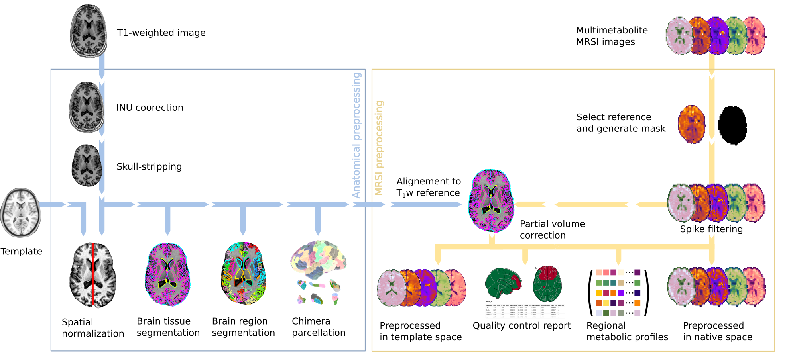

# *MRSIPrep*: A Robust Preprocessing Pipeline for Whole-Brain MRSI Data

## About

*MRSIPrep* is a preprocessing and derivative-generation pipeline for already
quantified whole-brain MRSI maps, run as a BIDS App via Docker. Its default
`mni-norm` mode normalizes MRSI maps to a specified template for
[voxel-based analysis](https://github.com/MRSI-Psychosis-UP/VLAD).
`parc-con` mode adds SynthSeg+FAST tissue maps, PETPVC, and Chimera/MNI-atlas
regional profile extraction for metabolic connectivity computation. MRSIPrep
creates a quality-control report for each run.

**Full documentation, installation, and usage instructions are on
[Read the Docs](https://mrsiprep.readthedocs.io/en/stable/).**

## Design Principles

MRSIPrep was designed according to four main principles:

- **Reproducibility** — distributed as open-source software, executed in
  containerized environments to minimize differences across computing
  platforms.
- **Modularity** — each processing stage is an independent module, so users
  can enable, disable, or replace specific steps according to their
  acquisition protocol and scientific question.
- **Transparency** — automated quality-control reports summarize spatial
  registration, metabolite coverage, voxel-level quality metrics, tissue
  composition, and atlas projection, including the acquisition's
  [MRSinMRS](https://pubmed.ncbi.nlm.nih.gov/33559967/) sequence parameters
  (from an optional `mrsinmrs.json`) and a citation section. Published-study
  parameter sets can be reproduced with `--config-preset <name>`
  (see `--list-presets`), which also credits the source publication in the
  report.
- **Analysis agnosticism** — MRSIPrep does not impose a specific downstream
  analysis; it generates standardized derivatives usable for voxelwise
  analyses, regional analyses, metabolic connectomics, gradient mapping, or
  machine-learning workflows.

See [Read the Docs](https://mrsiprep.readthedocs.io/en/stable/) for the full
workflow architecture and quality-control framework.

## Test Dataset

A small, public, synthetic MRSI dataset — **SynthMRSI-Project** — is
available for anyone to download and run through MRSIPrep themselves,
without needing access to real MRSI acquisitions. It pairs real T1w
anatomical images (subsetted from two CC0 OpenNeuro datasets) with
model-synthesized MRSI signal and empirical CRLB/SNR/FWHM quality maps,
following MRSIPrep's own raw-MRSI-input convention.

- Published on Zenodo: [10.5281/zenodo.21477047](https://doi.org/10.5281/zenodo.21477047) (CC0)
- Full download and usage instructions: [PUBLIC_DATASET.md](PUBLIC_DATASET.md)
- Used as the fixture for this repo's automated end-to-end pipeline test (see
  the "tested on SynthMRSI-Project" badge above)

**SynthMRSI-Project is never modified after publication** — its Zenodo
record is fixed and citable. A separate, unpublished internal dataset,
**SynthMRSI-VBA-Project**, is used instead for voxel-based-analysis
validation work (region-based abnormality injection, ANTs-vs-FSL
registration-backend comparison via `randomise`). It shares the same T1w
subjects as SynthMRSI-Project but is generated independently with
`--inject-abnormal`, so it can carry deliberately-injected ground-truth
abnormalities without touching the published, immutable dataset. See
[`synthMRSI/SYNTHMRSI_PROJECT.md`](synthMRSI/SYNTHMRSI_PROJECT.md) for the
full generation and validation commands.

## Use Cases

Code derived from this pipeline has been used in the following peer-reviewed
publications:

- Lucchetti, F., Céléreau, E., Steullet, P., Alemán-Gómez, Y., Hagmann, P.,
  Klauser, A., & Klauser, P. (2025). Constructing the human brain metabolic
  connectome with MR spectroscopic imaging reveals cerebral biochemical
  organization. *Nature Communications*, 16.
  [doi:10.1038/s41467-025-66124-w](https://doi.org/10.1038/s41467-025-66124-w)
- Céléreau, E., Lucchetti, F., Alemán-Gómez, Y., Dwir, D., Cleusix, M.,
  Ledoux, J.-B., Jenni, R., Conchon, C., Bach Cuadra, M., Schilliger, Z.,
  Solida, A., Armando, M., Plessen, K. J., Hagmann, P., Conus, P., Klauser,
  A., & Klauser, P. (2026). High-resolution whole-brain magnetic resonance
  spectroscopic imaging in youth at risk for psychosis. *Imaging
  Neuroscience*, 4.
  [doi:10.1162/imag.a.1276](https://doi.org/10.1162/imag.a.1276)
- Céléreau, E., Lucchetti, F., Steullet, P., Schilliger, Z., Alemán-Gómez,
  Y., Jenni, R., Petrova, T., Forrer, S., Delavari, F., Ledoux, J.-B., et al.
  (2026). Sex differences in brain metabolism assessed with whole-brain
  magnetic resonance spectroscopic imaging. *bioRxiv*, 2026-06.
  [doi:10.64898/2026.06.30.735476](https://doi.org/10.64898/2026.06.30.735476)

## License

MRSIPrep is distributed under the CHUV academic non-commercial research
license; see [LICENSE](LICENSE) for the full text.

## Attribution

Substantial implementation logic is cropped and refactored by Federico Lucchetti and Edgar Céléreau. The original
license is included in `LICENSE`.

## Acknowledgments

MRSIPrep builds on the work of the ANTs, FreeSurfer, FSL, PETPVC, Chimera,
and TemplateFlow projects.
