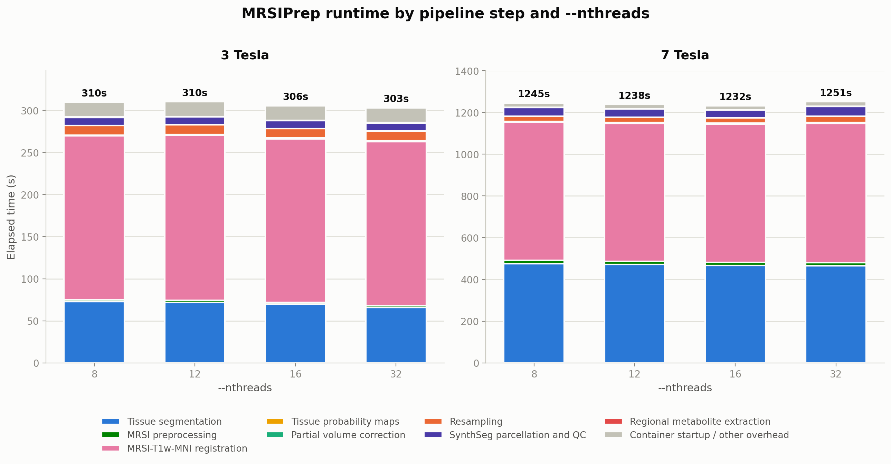
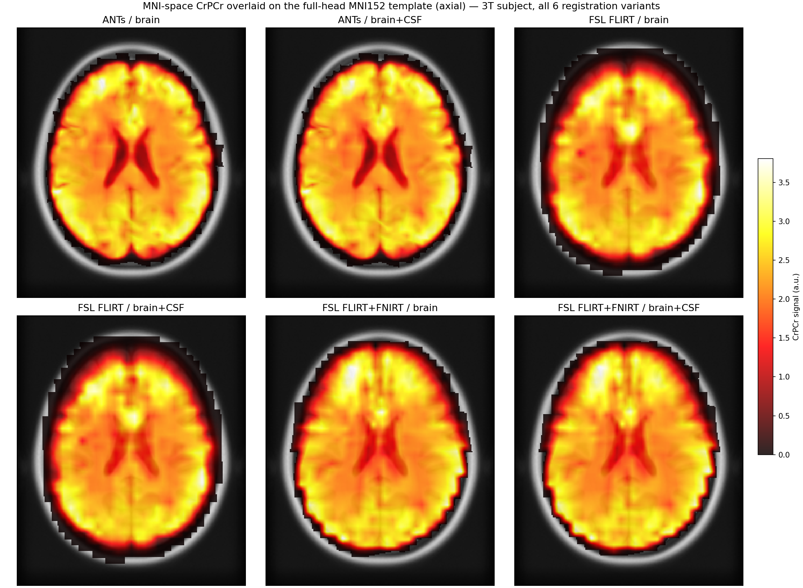

# Runtime Benchmarks

Wall-clock timing for MRSIPrep's `mni-norm` mode (default settings, ANTs
registration backend) across a range of `--nthreads` values, on two
subjects acquired at different field strengths, to give a sense of how
runtime scales with acquisition resolution as well as thread count.

## Hardware

### Compute (this benchmark)

| Component | Spec |
|---|---|
| CPU | Intel Core i9-14900K, 24 cores / 32 threads, up to 6.0 GHz |
| RAM | 125 GB |
| GPU | NVIDIA RTX 5000 Ada Generation, 32 GB VRAM (not used by `mni-norm` mode; SynthSeg here ran CPU-only) |
| OS | Linux 5.15 (Ubuntu) |
| Docker | 29.4.1 |
| MRSIPrep image | `mrsiup/mrsiprep:cpu` |

### MRI scanners

| | 3 Tesla | 7 Tesla |
|---|---|---|
| Scanner | Magnetom TrioTim | Magnetom Terra.X |
| Coil | 32-channel | 32-channel |

## MRSI Acquisition: ECCENTRIC

Both datasets were acquired with the **ECCENTRIC** FID-MRSI sequence
([Klauser et al., 2024, *Imaging Neuroscience*](https://direct.mit.edu/imag/article/doi/10.1162/imag_a_00313/124597/ECCENTRIC-A-fast-and-unrestrained-approach-for),
"ECCENTRIC: A fast and unrestrained approach for high-resolution
whole-brain metabolic imaging at ultra-high magnetic field"), a
compressed-sensing-accelerated concentric-ring k-space trajectory
designed for fast, high-resolution whole-brain MRSI.

### Metabolite acquisition

| Parameter | 3 Tesla | 7 Tesla |
|---|---|---|
| Field of view | 220 × 220 × 130 mm³ | 220 × 220 × 110 mm³ |
| Slab thickness | 95 mm | 100 mm |
| Nominal voxel size | 5.0 × 5.0 × 5.2 mm³ | 3.4 × 3.4 × 3.5 mm³ |
| Scan resolution | 44 × 44 × 25 | 64 × 64 × 31 |
| TR | 457 ms | 400 ms |
| TE₁ / TE₂ | 0.78 ms / 65 ms | 0.68 ms |
| Flip angle | 45° | 35° |
| Spectral bandwidth | 1320 Hz | 2280 Hz |
| Vector size | 512 points | 688 FID points |
| Spatial encoding | ECCENTRIC trajectory, circle radius 0.25 k_max | ECCENTRIC trajectory, circle radius 0.25 k_max |
| Acceleration factor | 2.5 | 2.5 |
| Total acquisition time | 6 min 54 s | 11 min 52 s |

### Water reference

Matched spatial coverage, lower resolution — used for coil combination,
field correction, and metabolite intensity normalization.

| Parameter | 3 Tesla | 7 Tesla |
|---|---|---|
| Field of view | 220 × 220 × 130 mm³ | 220 × 220 × 110 mm³ |
| Nominal voxel size / resolution | 10.0 × 10.0 × 10.0 mm³ | 10 × 10 × 10 mm³ |
| Scan resolution | 22 × 22 × 13 | — |
| TR | 460 ms | 404 ms |
| TE₁ / TE₂ | 0.72 ms / 65 ms | 0.59 ms |
| Flip angle | 45° | 35° |
| Acquisition time | 1 min 21 s | 59 s |

### Reconstruction and quantification

Both MRSI acquisitions were reconstructed using a compressed-sensing SENSE
low-rank framework with total-generalized-variation regularization and
simultaneous lipid suppression. Metabolite quantification was performed
with **LCModel**.

## MRSIPrep Benchmark Method

Two single-subject `mrsiprep` runs, one per dataset, repeated at
`--nthreads` 8, 12, 16, and 32 (`--nproc 1` throughout — one subject per
run, so `--nthreads` is the only varying parameter). Each run used a
**fresh `--work-dir`** (no Nipype caching carried over between
thread-count variants), so every number below reflects genuine
full-pipeline computation, not a partially cached rerun.

- **3 Tesla subject** — a real MRSI acquisition with an MP2RAGE anatomical.
- **7 Tesla subject** — a real MRSI acquisition with an MP2RAGE
  anatomical.

Both runs: `--mode mni-norm --metabolites NAANAAG,GPCPCh,CrPCr,GluGln,Ins
--ref-met CrPCr`, default `--synthseg-mode robust`, default ANTs
registration backend.

### Resolution and useful-voxel counts

The two subjects differ substantially in both anatomical (T1w) and MRSI
grid resolution — this is the main driver of the runtime difference below,
since ANTs registration and SynthSeg both operate on the full-resolution
T1w volume, not the coarser MRSI grid.

| | 3 Tesla | 7 Tesla | Ratio (7T / 3T) |
|---|---:|---:|---:|
| T1w voxel size (mm) | 1.00 × 1.33 × 1.33 | 0.66 × 0.60 × 0.60 | — |
| T1w volume shape | 160 × 192 × 192 | 256 × 396 × 416 | — |
| T1w total voxels | ~5.9 M | ~42.2 M | **~7.2×** |
| MRSI voxel size (mm) | 5.00 × 5.00 × 5.25 | 3.44 × 3.44 × 3.55 | — |
| MRSI useful (non-zero, in-brain) voxels | 15,315 | 32,638 | **~2.1×** |

## Results

Stacked bar height = total wall-clock elapsed time (label above each bar);
segments show each pipeline step's share. "Container startup / other
overhead" covers Docker startup and the CLI's own preflight input-check,
which aren't wrapped in a named, timed pipeline step.

## Interpretation

* **Runtime is nearly unchanged from 8 to 32 threads** for both subjects, with variations of only ~2%. ANTs registration and SynthSeg show little scaling beyond ~8 threads, so for batch processing it is generally better to use ~8–12 threads per subject and increase `--nproc` rather than allocate more threads to each subject.

* **The 7T subject takes about 4× longer than the 3T subject** (~20.5 vs. ~5.1 minutes). This is mainly due to the 7T T1w image having ~7.2× more voxels, which increases registration and segmentation costs. The MRSI grid has only ~2.1× more usable voxels, making anatomical—not MRSI—resolution the main runtime driver.

## Registration Frameworks

`--registration-backend` offers **ANTs** (default: rigid+affine+SyN) and
**FSL** (FLIRT affine, with an FNIRT deformable stage on by default —
`--no-fsl-deformable` for FLIRT-only). This section compares all three
MRSI→T1w registration methods — **ANTs**, **FSL FLIRT-only**, and **FSL
FLIRT+FNIRT** — each against both supported T1w registration targets,
**brain** (skull-stripped) and **brain+CSF** (skull-stripped T1w with the
CSF compartment re-added, since CSF also produces real MRSI signal that a
brain-only target would otherwise clip at the boundary).

### Method

Full `mrsiprep --mode mni-norm` runs (not isolated registration calls) on
the same 3 Tesla and 7 Tesla subjects used above, varying
`--registration-backend`/`--fsl-deformable` and
`--registration-t1-target` (6 combinations × 2 subjects = 12 runs). For
each run, the MRSI brainmask was resampled into T1w space (nearest-
neighbor) and compared against three reference masks: the T1w brain-only
mask, the T1w brain+CSF mask, and the MNI152 template's own standard brain
mask (in MNI space) — counting how many resampled MRSI voxels fall
**outside** each reference mask, i.e., signal that has leaked past the
anatomical boundary it should be constrained to. See
`experiments/registration_backend_benchmark.py` (not published; internal
validation script).

### Results

Axial slice, same intensity scale across all 6 panels. The full-head
(non-skull-stripped) MNI152 template makes the skull boundary visible as a
bright ring — signal extending past it, or with a jagged/scalloped rather
than smooth outer edge, indicates voxels that have leaked beyond the true
brain boundary during registration.

**Voxels of the resampled MRSI brainmask falling outside each reference mask (lower is better):**

| Backend | Target | T1w brain outside | T1w brain+CSF outside | MNI brain outside |
|---|---|---:|---:|---:|
| **3 Tesla subject** | | | | |
| ANTs | brain | 235,260 (16.2%) | — | 419,612 (18.2%) |
| ANTs | brain+CSF | 234,683 (16.1%) | 227,705 (15.6%) | 410,039 (17.9%) |
| FSL FLIRT | brain | 510,625 (29.8%) | — | 962,120 (34.0%) |
| FSL FLIRT | brain+CSF | 512,023 (29.8%) | 504,875 (29.4%) | 959,834 (33.9%) |
| FSL FLIRT+FNIRT | brain | 292,456 (19.3%) | — | 610,207 (24.5%) |
| FSL FLIRT+FNIRT | brain+CSF | 291,099 (19.2%) | 284,186 (18.8%) | 605,568 (24.3%) |
| **7 Tesla subject** | | | | |
| ANTs | brain | 305,658 (11.4%) | — | 196,378 (10.4%) |
| ANTs | brain+CSF | 307,668 (11.5%) | 362,652 (13.5%) | 214,775 (11.3%) |
| FSL FLIRT | brain | 487,919 (17.0%) | — | 340,324 (16.8%) |
| FSL FLIRT | brain+CSF | 488,551 (17.1%) | 544,319 (19.1%) | 373,542 (18.1%) |
| FSL FLIRT+FNIRT | brain | 247,273 (10.1%) | — | 169,484 (9.8%) |
| FSL FLIRT+FNIRT | brain+CSF | 249,455 (10.2%) | 293,234 (11.9%) | 192,864 (10.9%) |

### Interpretation

* **ANTs gives the best-contained registration at 3T**, both numerically
  (lowest "outside brain" fraction in T1w and MNI space) and visually — the
  overlay figure shows the smoothest, most anatomically faithful outer
  boundary. At 7T, FSL FLIRT+FNIRT is roughly on par with ANTs numerically,
  though the overlay still shows a visibly more irregular (jagged) skull-
  adjacent edge for both FSL variants than for ANTs.

* **Adding FNIRT to the FSL backend substantially reduces leakage versus
  FLIRT-only** — roughly a third fewer outside-brain voxels at 3T (19.2–
  19.3% vs. 29.8%) and about 40% fewer at 7T (10.1–10.2% vs. 17.0–17.1%),
  consistent across both the T1w and MNI comparisons. This is why FNIRT is
  now the default for `--registration-backend fsl`.

* **Brain vs. brain+CSF as the T1w registration target makes only a small
  difference** (typically within 1-2 percentage points, and not
  consistently in one direction) to how many MRSI voxels land outside the
  brain boundary, for any backend. It does not, on its own, resolve the
  leakage seen with the FSL backend — the registration method itself (not
  the T1w target) is the dominant factor. `brain+CSF` remains useful when
  the analysis question specifically concerns CSF-compartment signal, but
  it is not a fix for FSL's wider skull-boundary leakage relative to ANTs.
