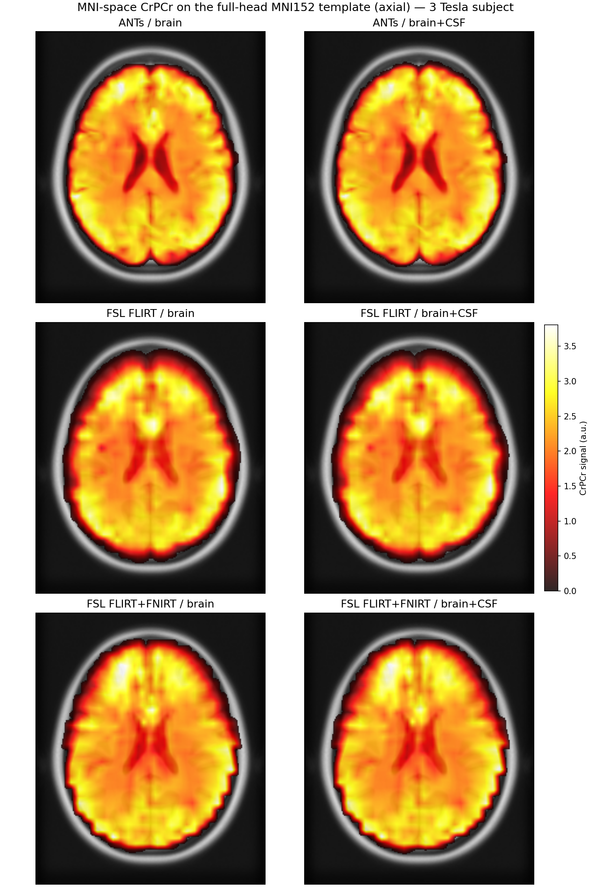
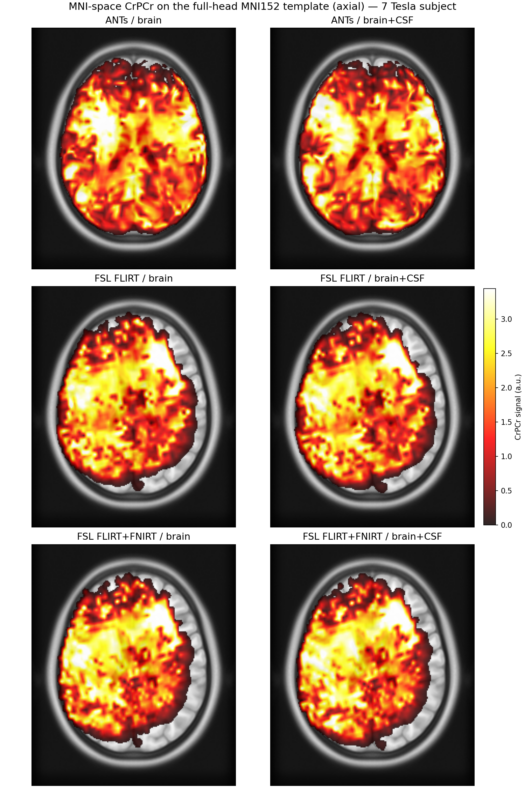
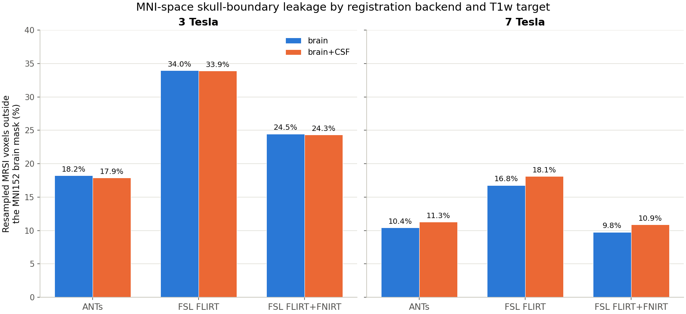

# Runtime Benchmarks

Wall-clock timing for MRSIPrep's `mni-norm` mode (default settings, ANTs
registration backend) across a range of `--nthreads` values, on two
subjects acquired at different field strengths, to give a sense of how
runtime scales with acquisition resolution as well as thread count.

## Hardware

### Compute (this benchmark)

| Component | Spec |
|---|---|
| CPU | Intel Core i9-14900K, 24 cores / 32 threads, up to 6.0 GHz |
| RAM | 125 GB |
| GPU | NVIDIA RTX 5000 Ada Generation, 32 GB VRAM (not used by `mni-norm` mode; SynthSeg here ran CPU-only) |
| OS | Linux 5.15 (Ubuntu) |
| Docker | 29.4.1 |
| MRSIPrep image | `mrsiup/mrsiprep:cpu` |

### MRI scanners

| | 3 Tesla | 7 Tesla |
|---|---|---|
| Scanner | Magnetom TrioTim | Magnetom Terra.X |
| Coil | 32-channel | 32-channel |

## MRSI Acquisition: ECCENTRIC

Both datasets were acquired with the **ECCENTRIC** FID-MRSI sequence
([Klauser et al., 2024, *Imaging Neuroscience*](https://direct.mit.edu/imag/article/doi/10.1162/imag_a_00313/124597/ECCENTRIC-A-fast-and-unrestrained-approach-for),
"ECCENTRIC: A fast and unrestrained approach for high-resolution
whole-brain metabolic imaging at ultra-high magnetic field"), a
compressed-sensing-accelerated concentric-ring k-space trajectory
designed for fast, high-resolution whole-brain MRSI.

### Metabolite acquisition

| Parameter | 3 Tesla | 7 Tesla |
|---|---|---|
| Field of view | 220 × 220 × 130 mm³ | 220 × 220 × 110 mm³ |
| Slab thickness | 95 mm | 100 mm |
| Nominal voxel size | 5.0 × 5.0 × 5.2 mm³ | 3.4 × 3.4 × 3.5 mm³ |
| Scan resolution | 44 × 44 × 25 | 64 × 64 × 31 |
| TR | 457 ms | 400 ms |
| TE₁ / TE₂ | 0.78 ms / 65 ms | 0.68 ms |
| Flip angle | 45° | 35° |
| Spectral bandwidth | 1320 Hz | 2280 Hz |
| Vector size | 512 points | 688 FID points |
| Spatial encoding | ECCENTRIC trajectory, circle radius 0.25 k_max | ECCENTRIC trajectory, circle radius 0.25 k_max |
| Acceleration factor | 2.5 | 2.5 |
| Total acquisition time | 6 min 54 s | 11 min 52 s |

### Water reference

Matched spatial coverage, lower resolution — used for coil combination,
field correction, and metabolite intensity normalization.

| Parameter | 3 Tesla | 7 Tesla |
|---|---|---|
| Field of view | 220 × 220 × 130 mm³ | 220 × 220 × 110 mm³ |
| Nominal voxel size / resolution | 10.0 × 10.0 × 10.0 mm³ | 10 × 10 × 10 mm³ |
| Scan resolution | 22 × 22 × 13 | — |
| TR | 460 ms | 404 ms |
| TE₁ / TE₂ | 0.72 ms / 65 ms | 0.59 ms |
| Flip angle | 45° | 35° |
| Acquisition time | 1 min 21 s | 59 s |

### Reconstruction and quantification

Both MRSI acquisitions were reconstructed using a compressed-sensing SENSE
low-rank framework with total-generalized-variation regularization and
simultaneous lipid suppression. Metabolite quantification was performed
with **LCModel**.

## MRSIPrep Benchmark Method

Two single-subject `mrsiprep` runs, one per dataset, repeated at
`--nthreads` 8, 12, 16, and 32 (`--nproc 1` throughout — one subject per
run, so `--nthreads` is the only varying parameter). Each run used a
**fresh `--work-dir`** (no Nipype caching carried over between
thread-count variants), so every number below reflects genuine
full-pipeline computation, not a partially cached rerun.

- **3 Tesla subject** — a real MRSI acquisition with an MP2RAGE anatomical.
- **7 Tesla subject** — a real MRSI acquisition with an MP2RAGE
  anatomical.

Both runs: `--mode mni-norm --metabolites NAANAAG,GPCPCh,CrPCr,GluGln,Ins
--ref-met CrPCr`, default `--synthseg-mode robust`, default ANTs
registration backend.

### Resolution and useful-voxel counts

The two subjects differ substantially in both anatomical (T1w) and MRSI
grid resolution — this is the main driver of the runtime difference below,
since ANTs registration and SynthSeg both operate on the full-resolution
T1w volume, not the coarser MRSI grid.

| | 3 Tesla | 7 Tesla | Ratio (7T / 3T) |
|---|---:|---:|---:|
| T1w voxel size (mm) | 1.00 × 1.33 × 1.33 | 0.66 × 0.60 × 0.60 | — |
| T1w volume shape | 160 × 192 × 192 | 256 × 396 × 416 | — |
| T1w total voxels | ~5.9 M | ~42.2 M | **~7.2×** |
| MRSI voxel size (mm) | 5.00 × 5.00 × 5.25 | 3.44 × 3.44 × 3.55 | — |
| MRSI useful (non-zero, in-brain) voxels | 15,315 | 32,638 | **~2.1×** |

## Results

Stacked bar height = total wall-clock elapsed time (label above each bar);
segments show each pipeline step's share. "Container startup / other
overhead" covers Docker startup and the CLI's own preflight input-check,
which aren't wrapped in a named, timed pipeline step.

## Interpretation

* **Runtime is nearly unchanged from 8 to 32 threads** for both subjects, with variations of only ~2%. ANTs registration and SynthSeg show little scaling beyond ~8 threads, so for batch processing it is generally better to use ~8–12 threads per subject and increase `--nproc` rather than allocate more threads to each subject.

* **The 7T subject takes about 4× longer than the 3T subject** (~20.5 vs. ~5.1 minutes). This is mainly due to the 7T T1w image having ~7.2× more voxels, which increases registration and segmentation costs. The MRSI grid has only ~2.1× more usable voxels, making anatomical—not MRSI—resolution the main runtime driver.

## Registration Frameworks

`--registration-backend` offers **ANTs** (default: rigid+affine+SyN) and
**FSL** (FLIRT affine, with an FNIRT deformable stage on by default —
`--no-fsl-deformable` for FLIRT-only). This section compares all three
MRSI→T1w registration methods — **ANTs**, **FSL FLIRT-only**, and **FSL
FLIRT+FNIRT** — each against both supported T1w registration targets,
**brain** (skull-stripped) and **brain+CSF** (skull-stripped T1w with the
CSF compartment re-added, since CSF also produces real MRSI signal that a
brain-only target would otherwise clip at the boundary).

### Method

Full `mrsiprep --mode mni-norm` runs (not isolated registration calls) on
the same 3 Tesla and 7 Tesla subjects used above, varying
`--registration-backend`/`--fsl-deformable` and
`--registration-t1-target` (6 combinations × 2 subjects = 12 runs). For
each run, the MRSI brainmask was resampled into T1w space (nearest-
neighbor) and compared against three reference masks: the T1w brain-only
mask, the T1w brain+CSF mask, and the MNI152 template's own standard brain
mask (in MNI space) — counting how many resampled MRSI voxels fall
**outside** each reference mask, i.e., signal that has leaked past the
anatomical boundary it should be constrained to. See
`experiments/registration_backend_benchmark.py` (not published; internal
validation script).

### Results

**3 Tesla subject**, all 6 backend/target combinations, axial slice, same
intensity scale throughout:

**7 Tesla subject**, same layout and intensity-scale convention (its own
scale, since 7T signal levels differ from 3T):

The full-head (non-skull-stripped) MNI152 template makes the skull
boundary visible as a bright ring; voxels with values below 0.1 are
rendered transparent so the underlying template stays visible through
low-signal regions. Signal extending past the skull ring, or with a
jagged/scalloped rather than smooth outer edge, indicates voxels that have
leaked beyond the true brain boundary during registration — visible here
for both FSL variants at both field strengths, and especially pronounced
(plus visibly asymmetric between hemispheres) for the FSL backend at 7T.

**Resampled MRSI voxels falling outside the MNI152 brain mask, by backend and T1w target:**

### Interpretation

* **ANTs is the clear winner at both field strengths.** It has the lowest
  MNI-outside-brain fraction of any backend at 3T (17.9–18.2%, vs. 24.3–
  24.5% for FSL FLIRT+FNIRT and 33.9–34.0% for FSL FLIRT-only) and is
  essentially tied with FSL FLIRT+FNIRT at 7T (10.4–11.3% vs. 9.8–10.9%).
  The overlay figures confirm this visually: ANTs produces the smoothest,
  most anatomically faithful outer boundary at both field strengths, while
  both FSL variants show a visibly irregular, jagged edge — most obviously
  at 7T, where the FSL backend's coverage is also noticeably asymmetric
  between hemispheres.

* **Adding FNIRT to the FSL backend substantially reduces leakage versus
  FLIRT-only** — roughly a third fewer outside-brain voxels at 3T (24.3–
  24.5% vs. 33.9–34.0%) and about 40% fewer at 7T (9.8–10.9% vs. 16.8–
  18.1%). This is why FNIRT is now the default for
  `--registration-backend fsl`.

* **Brain vs. brain+CSF as the T1w registration target has a small effect
  that flips direction between field strengths.** At 3T, brain+CSF is
  very slightly better than brain-only for every backend (by 0.1–0.3
  percentage points). At 7T, brain+CSF is consistently *worse* than
  brain-only for every backend (by 0.9–1.3 percentage points) — the
  opposite of what higher spatial resolution alone would predict (more
  voxels landing purely in CSF should, in principle, make a CSF-inclusive
  target relatively more helpful, not less, at finer resolution). The
  effect is small enough in both directions, and its sign reverses between
  the two subjects here, that it should not be read as a reliable
  advantage for either target — the registration backend and deformable
  stage are the dominant factors, not the brain-vs-brain+CSF choice.
