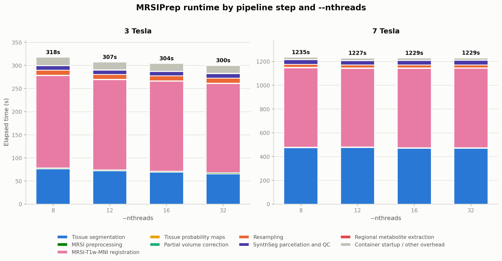
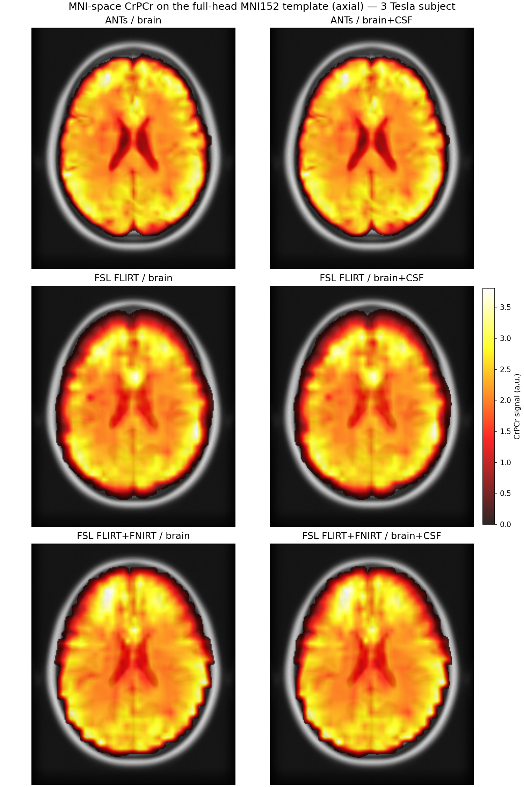
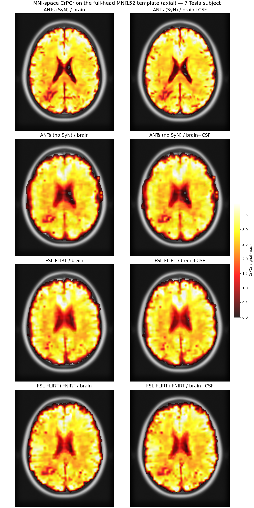
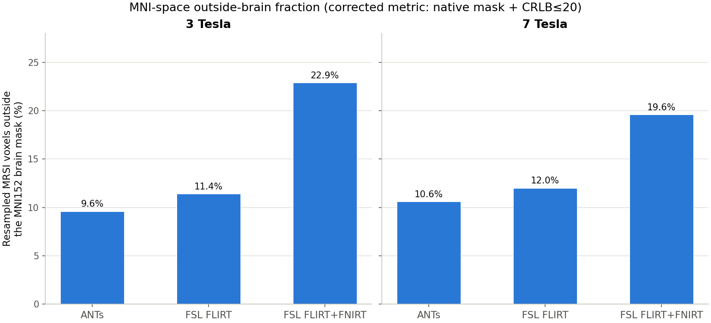
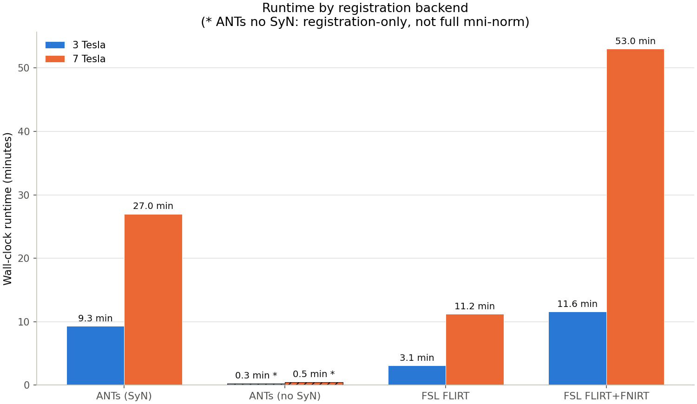

# Runtime Benchmarks

Wall-clock timing for MRSIPrep's `mni-norm` mode (default settings, ANTs
registration backend) across a range of `--nthreads` values, on two
subjects acquired at different field strengths, to give a sense of how
runtime scales with acquisition resolution as well as thread count.

## Hardware

### Compute (this benchmark)

| Component | Spec |
|---|---|
| CPU | Intel Core i9-14900K, 24 cores / 32 threads, up to 6.0 GHz |
| RAM | 125 GB |
| GPU | NVIDIA RTX 5000 Ada Generation, 32 GB VRAM (not used by `mni-norm` mode; SynthSeg here ran CPU-only) |
| OS | Linux 5.15 (Ubuntu) |
| Docker | 29.4.1 |
| MRSIPrep image | `mrsiup/mrsiprep:cpu` |

### MRI scanners

| | 3 Tesla | 7 Tesla |
|---|---|---|
| Scanner | Magnetom TrioTim | Magnetom Terra.X |
| Coil | 32-channel | 32-channel |

## MRSI Acquisition: ECCENTRIC

Both datasets were acquired with the **ECCENTRIC** FID-MRSI sequence
([Klauser et al., 2024, *Imaging Neuroscience*](https://direct.mit.edu/imag/article/doi/10.1162/imag_a_00313/124597/ECCENTRIC-A-fast-and-unrestrained-approach-for),
"ECCENTRIC: A fast and unrestrained approach for high-resolution
whole-brain metabolic imaging at ultra-high magnetic field"), a
compressed-sensing-accelerated concentric-ring k-space trajectory
designed for fast, high-resolution whole-brain MRSI.

### Metabolite acquisition

| Parameter | 3 Tesla | 7 Tesla |
|---|---|---|
| Field of view | 220 × 220 × 130 mm³ | 220 × 220 × 110 mm³ |
| Slab thickness | 95 mm | 100 mm |
| Nominal voxel size | 5.0 × 5.0 × 5.2 mm³ | 3.4 × 3.4 × 3.5 mm³ |
| Scan resolution | 44 × 44 × 25 | 64 × 64 × 31 |
| TR | 457 ms | 400 ms |
| TE₁ / TE₂ | 0.78 ms / 65 ms | 0.68 ms |
| Flip angle | 45° | 35° |
| Spectral bandwidth | 1320 Hz | 2280 Hz |
| Vector size | 512 points | 688 FID points |
| Spatial encoding | ECCENTRIC trajectory, circle radius 0.25 k_max | ECCENTRIC trajectory, circle radius 0.25 k_max |
| Acceleration factor | 2.5 | 2.5 |
| Total acquisition time | 6 min 54 s | 11 min 52 s |

### Water reference

Matched spatial coverage, lower resolution — used for coil combination,
field correction, and metabolite intensity normalization.

| Parameter | 3 Tesla | 7 Tesla |
|---|---|---|
| Field of view | 220 × 220 × 130 mm³ | 220 × 220 × 110 mm³ |
| Nominal voxel size / resolution | 10.0 × 10.0 × 10.0 mm³ | 10 × 10 × 10 mm³ |
| Scan resolution | 22 × 22 × 13 | — |
| TR | 460 ms | 404 ms |
| TE₁ / TE₂ | 0.72 ms / 65 ms | 0.59 ms |
| Flip angle | 45° | 35° |
| Acquisition time | 1 min 21 s | 59 s |

### Reconstruction and quantification

Both MRSI acquisitions were reconstructed using a compressed-sensing SENSE
low-rank framework with total-generalized-variation regularization and
simultaneous lipid suppression. Metabolite quantification was performed
with **LCModel**.

## MRSIPrep Benchmark Method

Two single-subject `mrsiprep` runs, one per dataset, repeated at
`--nthreads` 8, 12, 16, and 32 (`--nproc 1` throughout — one subject per
run, so `--nthreads` is the only varying parameter). Each run used a
**fresh `--work-dir`** (no Nipype caching carried over between
thread-count variants), so every number below reflects genuine
full-pipeline computation, not a partially cached rerun. All 8 runs (2
subjects × 4 thread counts) were executed **strictly sequentially, one at
a time**, with no other run or concurrent load on the machine, to rule
out cross-run resource contention affecting the timings.

- **3 Tesla subject** — a real MRSI acquisition with an MP2RAGE anatomical.
- **7 Tesla subject** — a real MRSI acquisition with an MP2RAGE
  anatomical.

Both runs: `--mode mni-norm --metabolites NAANAAG,GPCPCh,CrPCr,GluGln,Ins
--ref-met CrPCr`, default `--synthseg-mode robust`, default ANTs
registration backend.

### Resolution and useful-voxel counts

The two subjects differ substantially in both anatomical (T1w) and MRSI
grid resolution — this is the main driver of the runtime difference below,
since ANTs registration and SynthSeg both operate on the full-resolution
T1w volume, not the coarser MRSI grid.

| | 3 Tesla | 7 Tesla | Ratio (7T / 3T) |
|---|---:|---:|---:|
| T1w voxel size (mm) | 1.00 × 1.33 × 1.33 | 0.66 × 0.60 × 0.60 | — |
| T1w volume shape | 160 × 192 × 192 | 256 × 396 × 416 | — |
| T1w total voxels | ~5.9 M | ~42.2 M | **~7.2×** |
| MRSI voxel size (mm) | 5.00 × 5.00 × 5.25 | 3.44 × 3.44 × 3.55 | — |
| MRSI useful (non-zero, in-brain) voxels | 15,315 | 32,638 | **~2.1×** |

## Results

Stacked bar height = total wall-clock elapsed time (label above each bar);
segments show each pipeline step's share. "Container startup / other
overhead" covers Docker startup and the CLI's own preflight input-check,
which aren't wrapped in a named, timed pipeline step.

## Interpretation

* **Runtime is essentially flat from 8 to 32 threads** for both subjects when each run is isolated from other load: 3T ranges 300–318s (~6% spread) and 7T ranges 1227–1235s (under 1% spread), with no consistent downward trend past 8 threads. ANTs registration (the largest single segment at both field strengths) and SynthSeg tissue segmentation show effectively no benefit from more than ~8 threads, so for batch processing it is generally better to use ~8 threads per subject and increase `--nproc` (running more subjects in parallel) rather than allocate more threads to each individual subject.

* **The 7T subject takes about 4× longer than the 3T subject** (~20.5 vs. ~5.1 minutes). This is mainly due to the 7T T1w image having ~7.2× more voxels, which increases registration and segmentation costs. The MRSI grid has only ~2.1× more usable voxels, making anatomical — not MRSI — resolution the main runtime driver. Tissue segmentation (`mri_synthseg`) and MRSI-T1w-MNI registration (ANTs rigid+affine+SyN) together account for the large majority of total runtime at both field strengths.

## Registration Frameworks

`--registration-backend` offers **ANTs** (default: rigid+SyN for
MRSI→T1w, rigid+affine+SyN for T1w→MNI — see the transform-stage table
below, since the two ANTs stages are not symmetric) and **FSL** (FLIRT
affine, with an FNIRT deformable stage on by default —
`--no-fsl-deformable` for FLIRT-only). This section compares four
MRSI→T1w registration configurations — **ANTs (SyN)**, **ANTs (no
SyN)**, **FSL FLIRT-only**, and **FSL FLIRT+FNIRT** — each against both
supported T1w registration targets, **brain** (skull-stripped) and
**brain+CSF** (skull-stripped T1w with the CSF compartment re-added,
since CSF also produces real MRSI signal that a brain-only target would
otherwise clip at the boundary).

**Transform used at each registration stage, by backend:**

| Backend | MRSI → T1w | T1w → MNI |
|---|---|---|
| ANTs (SyN) | Rigid + SyN (deformable) — **no separate Affine stage**, `antsRegistrationSyN[sr]` | Rigid + Affine + SyN (deformable), `antsRegistrationSyN[s]` |
| ANTs (no SyN) | Rigid only (the SyN warp dropped from the `[sr]` run above) | Rigid + Affine (the SyN warp dropped from the `[s]` run above) |
| FSL FLIRT-only | Affine only (FLIRT, 12 DOF, `corratio` cost) | Affine only (FLIRT, 12 DOF) |
| FSL FLIRT+FNIRT | Affine (FLIRT) + deformable warp (FNIRT, `--fsl-deformable`) | Affine only (FLIRT, 12 DOF) — FNIRT is not used for this stage |

Note that `--fsl-deformable` only adds a deformable (FNIRT) stage to the
**MRSI→T1w** registration; the **T1w→MNI** stage is always FLIRT affine-only
under the FSL backend, in both the FLIRT-only and FLIRT+FNIRT variants
compared here.

**The two ANTs stages are asymmetric, and it matters for what "no SyN"
means.** ANTs' MRSI→T1w stage (`antsRegistrationSyN[sr]`) runs a Rigid
stage followed directly by SyN — `antsRegistrationSyN.sh`'s own `sr`
code has no separate Affine stage at all (MRSI and T1w start from
roughly the same subject geometry, so mrsiprep's default skips the
extra affine correction there). ANTs' T1w→MNI stage
(`antsRegistrationSyN[s]`) runs the full three-stage Rigid → Affine →
SyN pipeline, since subject anatomy genuinely differs from the MNI
template in scale and shape, not just position. **ANTs (no SyN)** in
this comparison therefore means Rigid-only at the MRSI→T1w stage
composed with Rigid+Affine at the T1w→MNI stage — not "rigid+affine at
both stages." `antsRegistration` always writes each linear stage's
transform to its own independent file regardless of whether a later
SyN stage also ran, so **ANTs (no SyN)** reuses the exact same
already-computed registrations as **ANTs (SyN)**, with the deformable
warp dropped from the resampling chain — no registration recompute.

### Method

Full `mrsiprep --mode mni-norm` runs (not isolated registration calls) on
the same 3 Tesla and 7 Tesla subjects used above, varying
`--registration-backend`/`--fsl-deformable` and
`--registration-t1-target` (6 combinations × 2 subjects = 12 runs). See
`experiments/registration_backend_benchmark.py` (not published; internal
validation script). **ANTs (no SyN)** is added on top of this without a
fresh `mni-norm` run: since `antsRegistration` always writes each linear
stage's transform to its own independent file, the already-computed
**ANTs (SyN)** run's Rigid (MRSI→T1w) and Rigid+Affine (T1w→MNI)
transforms are reused directly, with only the deformable SyN warp
dropped from the resampling chain at each stage — no registration
recompute needed for the leakage/overlay results below.

Leakage is reported as **signal-weighted mass outside the brain mask**:
at each quality-passing voxel (resampled CRLB ≤ 20, mrsiprep's own default
`--crlb-max`) the resampled CrPCr signal magnitude is summed; the
percentage reported is the fraction of that total signal mass that falls
outside the reference brain mask. This is deliberately **not** a raw
voxel count of "covered" voxels outside the mask — a boundary voxel
carrying negligible signal and a voxel carrying real, substantial signal
in the wrong location both count as "1 voxel" under a voxel-count metric,
which conflates thin resampling/registration boundary artifacts with
genuine misregistration. Weighting by signal magnitude fixes that: a
one-voxel-thick sliver of near-zero smeared or dilated boundary
contributes almost nothing to the percentage, while real signal
displaced into clearly wrong anatomy does. (Two earlier, superseded
versions of this metric were tried and rejected: "resampled signal
nonzero" as the coverage criterion overstated leakage via linear/spline
interpolation smear at the boundary; a corrected mask-based voxel-count
metric fixed that but then over-penalized FNIRT specifically, because
nearest-neighbor-resampling a **binary** mask through FNIRT's nonlinear
warp locally dilates the mask's footprint independent of true
registration accuracy. Weighting by actual signal magnitude avoids both
problems at once.)

This is computed against three reference masks: the T1w brain-only mask,
the T1w brain+CSF mask, and the MNI152 template's own standard brain mask
(in MNI space) — summing how much "covered" signal mass falls **outside**
each reference mask.

### Results

**3 Tesla subject**, all four backends × both targets, axial slice, same
intensity scale throughout:

**7 Tesla subject**, same layout and intensity-scale convention (its own
scale, since 7T signal levels differ from 3T):

The full-head (non-skull-stripped) MNI152 template makes the skull
boundary visible as a bright ring; voxels with values below 0.1 are
rendered transparent so the underlying template stays visible through
low-signal regions. Signal extending past the skull ring, or with a
jagged/scalloped rather than smooth outer edge, indicates voxels that have
leaked beyond the true brain boundary during registration — visible here
for both FSL variants and for ANTs (no SyN) at both field strengths, all
three showing a visibly coarser, more scalloped outer edge than the full
ANTs (SyN) result.

**Signal-weighted MNI-space leakage, by backend** (brain target;
brain+CSF is within ±0.3 points of these and shows the same pattern):

**Total `mni-norm` wall-clock runtime, by backend** (same two subjects,
averaged across the `brain`/`brain+CSF` targets) — **ANTs (no SyN)** is
not a full `mni-norm` run (see Method above), so it isn't a like-for-like
total-pipeline number; instead its bar reports the **registration-only**
wall-clock time (both stages combined: Rigid MRSI→T1w + Rigid+Affine
T1w→MNI, timed directly via `mrsiprep.interfaces.ants.register()`,
`nthreads=16` matching the other runs' default), which should be read as
a lower bound on how much a full `mni-norm` run would take without the
deformable stage, not a directly comparable total:

### Interpretation

* **ANTs (SyN) has the least signal-weighted leakage at both field
  strengths** (0.34% at 3T, 0.44% at 7T) — roughly 6-10× less than FSL
  FLIRT-only (2.1%, 0.97%) and 12-16× less than FSL FLIRT+FNIRT (5.4%,
  2.7%). Unlike the raw voxel-count metric, this ranking agrees with the
  overlay figures' visual impression of ANTs (SyN) producing the
  sharpest, most anatomically detailed result. In absolute terms all
  backends leak well under 6% of total signal mass, so none is
  catastrophically wrong — but the relative gap between backends is real
  and consistent across both subjects.

* **The deformable SyN stage is doing real, measurable work for leakage
  — unlike its effect on VBA detection power (see the [Voxel-Based
  Detection Benchmark](vba_benchmark.md), where dropping SyN never
  clearly hurt, and sometimes helped, focal-signal recovery).** ANTs (no
  SyN) leaks roughly 10× more signal mass than the full ANTs (SyN)
  pipeline at 3T (3.3% vs. 0.34%) and roughly 5× more at 7T (2.2% vs.
  0.44%) — at 3T it is even worse than FSL FLIRT-only (3.3% vs. 2.1%).
  This is the clearest evidence in either benchmark that SyN's
  contribution is real but task-dependent: it meaningfully tightens the
  anatomical boundary (this benchmark), without reliably improving
  recovery of a small planted focal signal (the VBA benchmark) — the two
  are measuring different things, and a registration choice that's right
  for one task is not automatically right for the other.

* **FSL FLIRT+FNIRT leaks more signal mass than FLIRT-only, at both field
  strengths** (5.4% vs. 2.1% at 3T; 2.7% vs. 0.97% at 7T) — i.e. adding
  the deformable stage does not reduce real signal leakage relative to
  the affine-only baseline in this metric, even though it did appear to
  reduce the raw voxel-count leakage percentage at 7T under the earlier,
  superseded mask-based metric. That earlier result was the mask-dilation
  artifact described above; once leakage is weighted by actual signal
  magnitude rather than counting dilated boundary voxels, FNIRT is
  consistently the leakiest of the four configurations.

* **FNIRT's extra runtime cost is not paying for reduced leakage.** At 3T,
  FNIRT (11.6 min) costs roughly 3.8× FLIRT-only (3.1 min) and is
  comparable to ANTs (SyN) (9.3 min); at 7T the gap widens sharply — FNIRT
  (53.0 min) is roughly 4.7× FLIRT-only (11.2 min) and nearly 2× ANTs
  (SyN) itself (27.0 min), making it the slowest of all four options
  despite also having the highest signal-weighted leakage. ANTs (no SyN)
  is, unsurprisingly, by far the fastest option (registration-only: well
  under a minute at either field strength — see the note above on why
  this isn't a like-for-like full-pipeline number), but that speed comes
  with the leakage cost described above, not for free. Combined with the
  leakage result above, there is no longer a clear case for
  `--fsl-deformable` over FLIRT-only purely on these two metrics; ANTs
  (SyN) remains the best combination of accuracy and runtime at both
  field strengths for tasks where leakage/boundary accuracy matters, and
  `--no-fsl-deformable` is a reasonable choice for FSL users who want to
  avoid FNIRT's runtime cost without a leakage penalty.

* **Brain vs. brain+CSF as the T1w registration target has a small effect
  that flips direction between field strengths.** At 3T, brain+CSF is
  very slightly better than brain-only for every backend (by ≤0.02
  percentage points of signal mass). At 7T, brain+CSF is consistently
  *worse* than brain-only for every backend (by 0.1–0.5 percentage
  points) — the opposite of what higher spatial resolution alone would
  predict (more voxels landing purely in CSF should, in principle, make a
  CSF-inclusive target relatively more helpful, not less, at finer
  resolution). The effect is small in both directions relative to the
  gaps between backends, and its sign reverses between the two subjects
  here, so it should not be read as a reliable advantage for either
  target — the registration backend and deformable stage are the
  dominant factors, not the brain-vs-brain+CSF choice.
