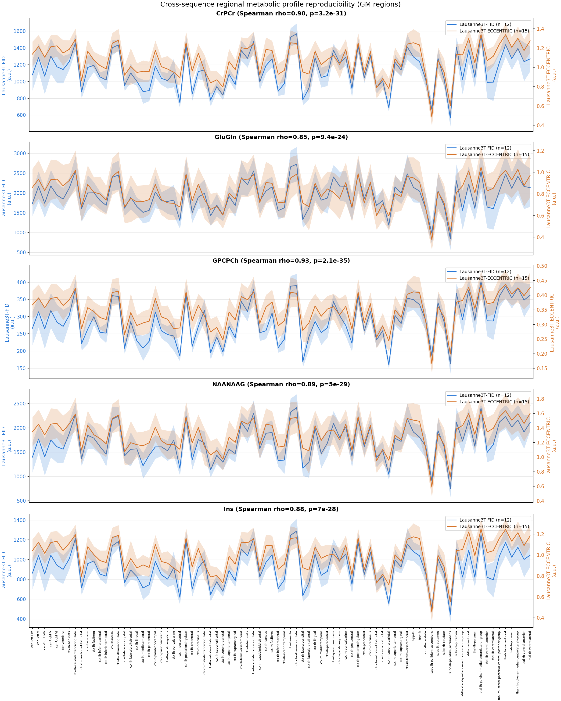

# Cross-Site/Cross-Sequence Regional Profile Reproducibility

The benchmarks on the other two pages validate MRSIPrep's registration and
detection performance on data it was built and tuned against — a real
3T/7T ECCENTRIC pair, and a synthetic ground-truth cohort. This page tests
something harder: whether MRSIPrep-derived regional metabolite profiles
reproduce on entirely independent real-world data — different subjects,
different scanners, different sites, and different MRSI sequences,
processed with the same pipeline and parcellation.

Because absolute metabolite units are not expected to agree across
different sequences and field strengths — scanner-, sequence-, and
reconstruction-dependent scaling and referencing choices affect the
overall signal level independently of true tissue concentration — this is
deliberately framed as a test of whether the **relative spatial pattern**
of regional metabolite levels reproduces across acquisitions, not whether
absolute values agree.

## Dataset

Two independently acquired real-world datasets, merged into one group-level
MRSIPrep connectivity/profile archive.

| | Lausanne3T-FID | Lausanne3T-ECCENTRIC |
|---|---|---|
| n | 12 | 15 |

## Method

For each of the 5 metabolites (CrPCr, GluGln, GPCPCh, NAANAAG, Ins) and
each of the 203 parcels of the `chimeraLFMIHIFIS` scale-3 parcellation:

1. **Per-subject point estimate**: the median across the
   $K_{\mathrm{pert}}=50$ CRLB-perturbed draws in the archive's
   `metab_profiles_subj_list` array (shape `(subjects, parcels, nperm,
   metabolites)`) — MRSIPrep's uncertainty-propagated regional profile
   estimation, see the main docs' connectivity/profile documentation.
2. **GM-only filtering**: excludes only `brain-stem-midbrain` (203 → 202
   parcels) as not cleanly gray matter. This parcellation scheme contains
   no white matter parcels at all — cortex (`ctx-`), cerebellum (`cer-`),
   hippocampus (`hipp-`), subcortical nuclei (`subc-`), and thalamic
   nuclei (`thal-`) are all retained. A GM+WM follow-up is left for future
   work once a scheme with WM parcels is used.
3. **Sub-parcel merging**: parcels sharing the same anatomical root differ
   only by the Lausanne scheme's finer sub-parcellation index (e.g.
   `ctx-lh-superiorfrontal_1` through `_8` are the same gyrus at finer
   granularity, not eight distinct regions) — averaged into a single
   root-region value per subject. This collapses 202 GM parcels into **82
   root regions**.
4. **Group profile**: for each metabolite and root region, the mean (and
   95% CI, across subjects) within each cohort.
5. **Cross-cohort comparison**: Spearman correlation between the two
   cohorts' 82-region mean profiles, per metabolite — a threshold-
   independent, scale-free test of whether the two acquisitions rank
   regions the same way, deliberately insensitive to any absolute scale
   difference between them.

## Results

| Metabolite | Spearman ρ | p-value | n roots |
|---|---:|---:|---:|
| GPCPCh | 0.93 | 2.1×10⁻³⁵ | 82 |
| CrPCr | 0.90 | 3.2×10⁻³¹ | 82 |
| NAANAAG | 0.89 | 5.0×10⁻²⁹ | 82 |
| Ins | 0.88 | 7.0×10⁻²⁸ | 82 |
| GluGln | 0.85 | 9.4×10⁻²⁴ | 82 |
