# MRSIPrep report: SynthMRSI-Project · sub-01 ses-01

## Inputs

BIDS directory: `/data`

Output directory: `/out/mrsiprep`

Parcellation mode: `chimera`

Tissue backend: `synthseg-fast`

## MRSI Raw QC

| metabolite | n_total_voxels | mean_snr | median_snr | mean_linewidth | median_linewidth | mean_crlb | median_crlb |
| --- | --- | --- | --- | --- | --- | --- | --- |
| NAANAAG | 20738 | 14.135942 | 15.0 | 0.038052 | 0.036 | 4.933007 | 4.0 |
| GPCPCh | 20738 | 14.228251 | 15.0 | 0.037878 | 0.036 | 6.853189 | 6.0 |
| CrPCr | 20738 | 14.257129 | 15.0 | 0.037799 | 0.036 | 6.431937 | 5.0 |
| GluGln | 20738 | 14.345459 | 15.0 | 0.037970 | 0.036 | 11.069957 | 11.0 |
| Ins | 20738 | 14.465190 | 15.0 | 0.037318 | 0.033 | 8.926435 | 8.0 |

### Raw metabolite maps (pre-pipeline)

### Metabolite: CrPCr

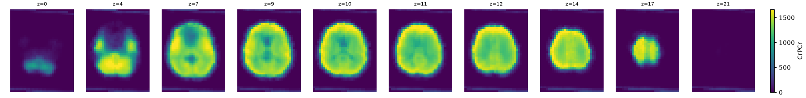

### Metabolite: GPCPCh

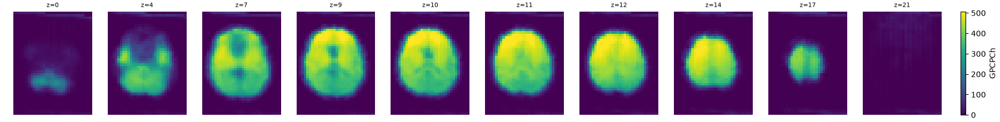

### Metabolite: GluGln

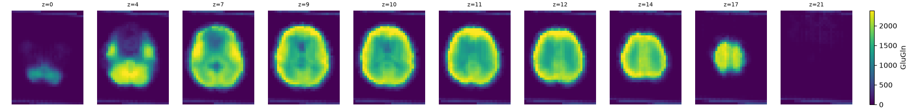

### Metabolite: Ins

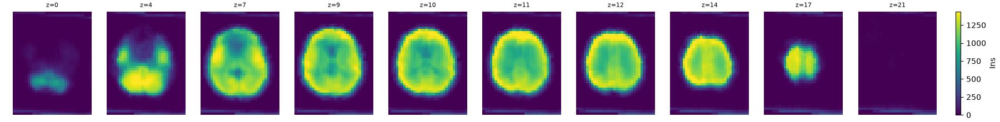

### Metabolite: NAANAAG

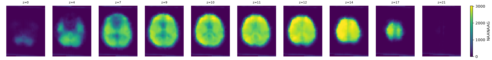

### Ventricle visibility (pre-coregistration)

detected ventricleMNI priornative MRSI space, pre-coregistration · all metabolites at z=10

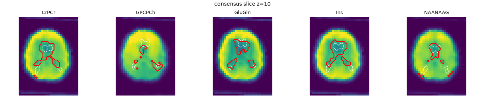

## MRSI PVC

### Partial-volume correction

Partial-volume-corrected metabolite maps, on the native MRSI grid, at the same slices as the MRSI Raw QC tab so the two can be compared directly.

### Metabolite: CrPCr

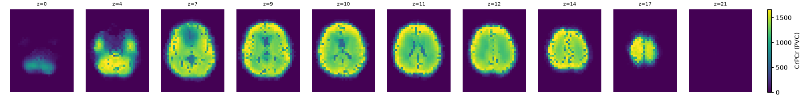

### Metabolite: GPCPCh

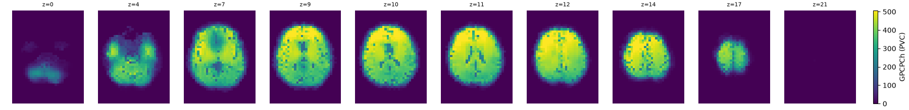

### Metabolite: GluGln

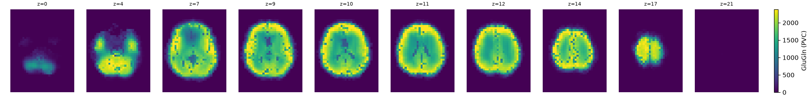

### Metabolite: Ins

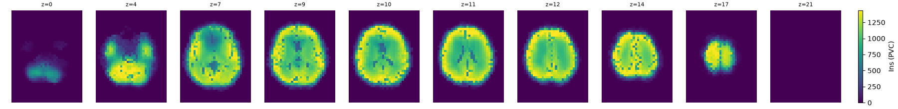

### Metabolite: NAANAAG

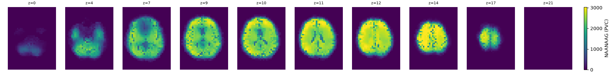

## Spike Filter

### Filtering summary

Slices centered on the centroid of all voxels repaired by spike/missing-voxel filtering, across all metabolites.

| Metabolite | Spike voxels detected |
| --- | --- |
| NAANAAG | 0 |
| GPCPCh | 0 |
| CrPCr | 7 |
| GluGln | 25 |
| Ins | 20 |

### Metabolite: NAANAAG

Spike voxels detected: 0

### Before

### After

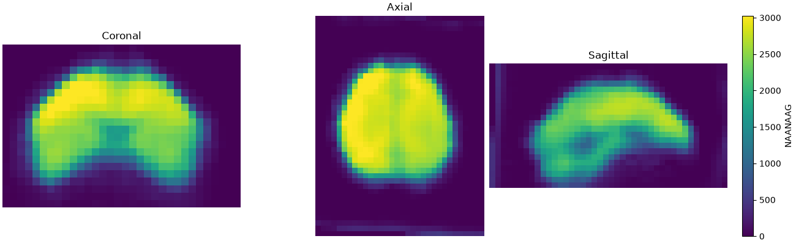

#### Whole image

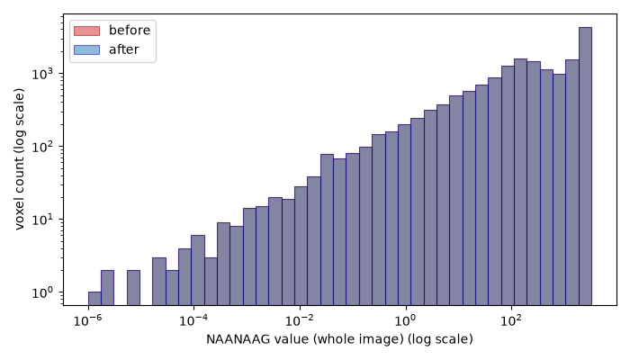

#### Spike voxels only

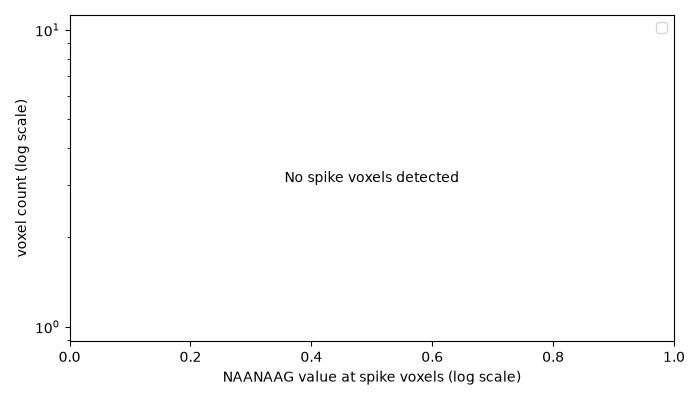

### Metabolite: GPCPCh

Spike voxels detected: 0

### Before

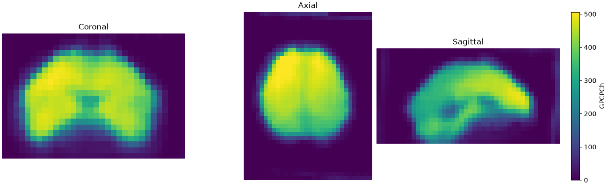

### After

#### Whole image

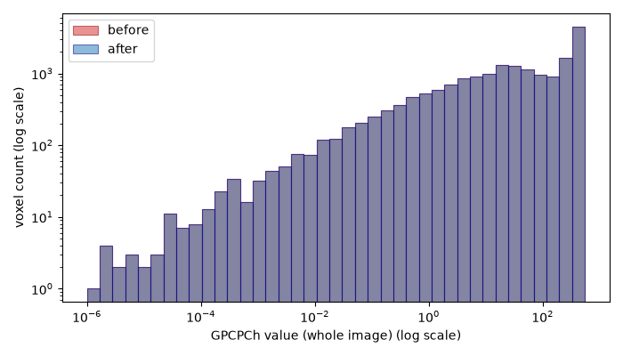

#### Spike voxels only

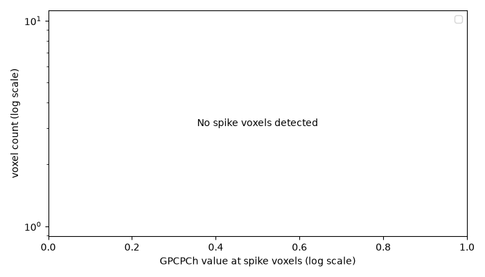

### Metabolite: CrPCr

Spike voxels detected: 7

### Before

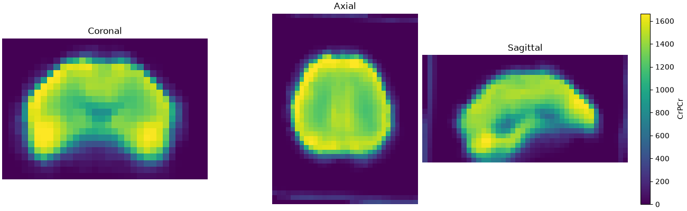

### After

#### Whole image

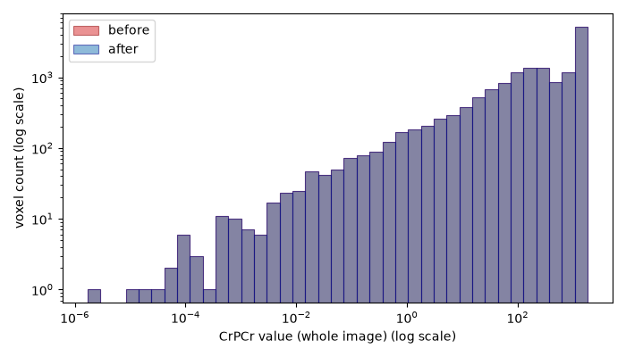

#### Spike voxels only

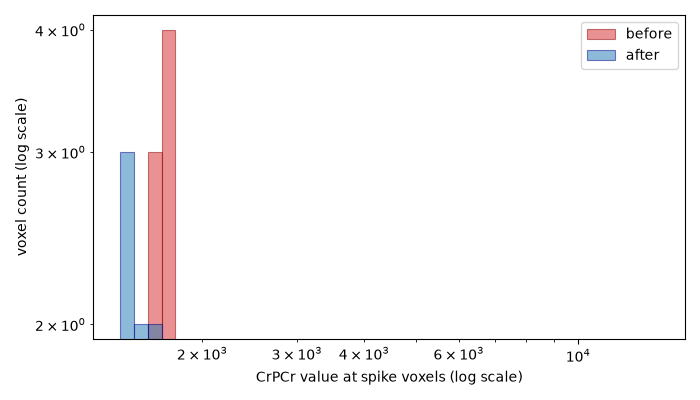

### Metabolite: GluGln

Spike voxels detected: 25

### Before

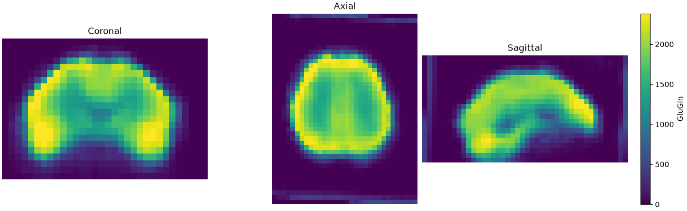

### After

#### Whole image

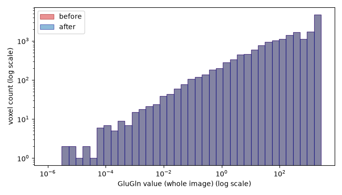

#### Spike voxels only

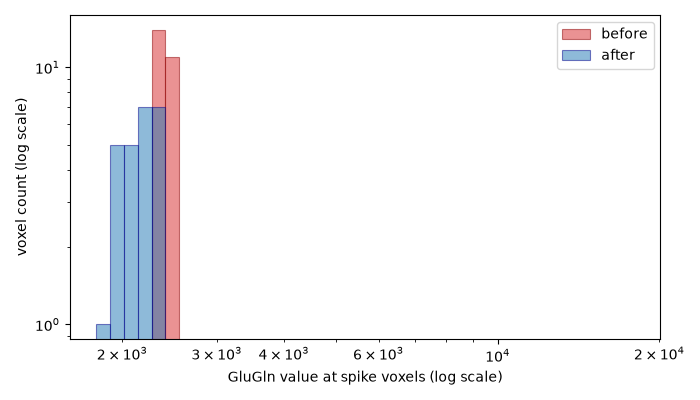

### Metabolite: Ins

Spike voxels detected: 20

### Before

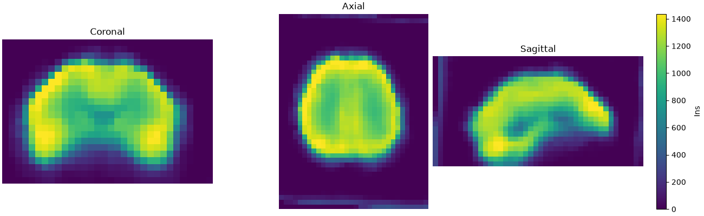

### After

#### Whole image

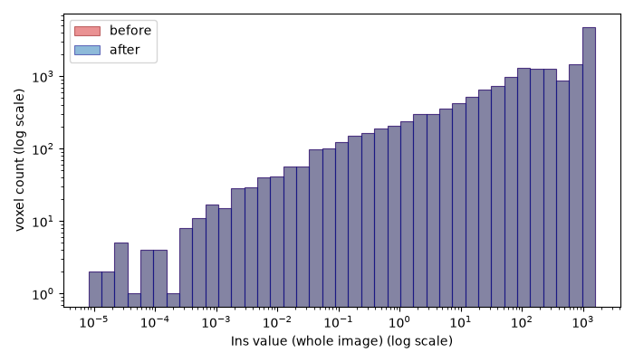

#### Spike voxels only

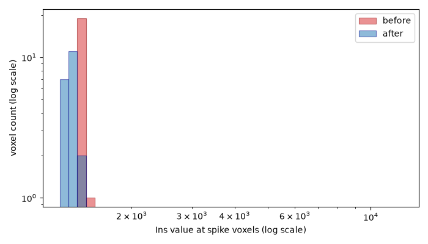

## Anatomical

### Tissue label outlines

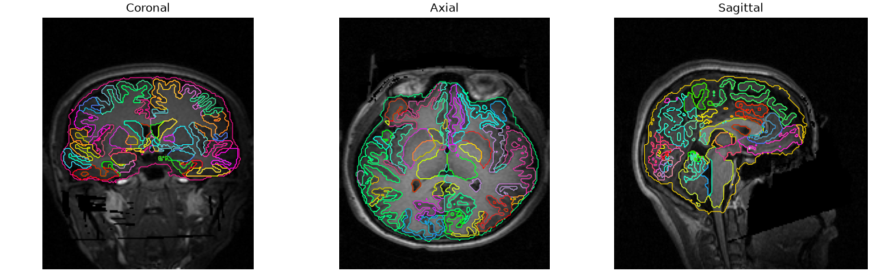

### Tissue probability maps

### GM

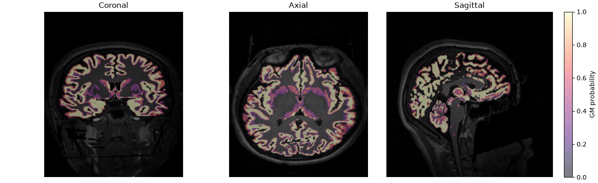

### WM

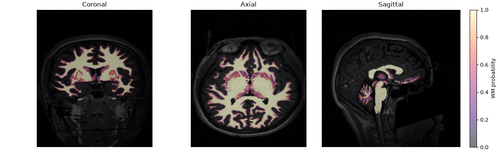

### CSF

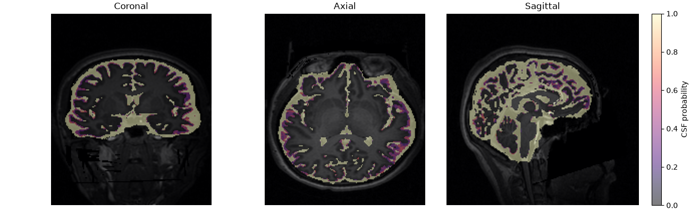

## T1-space alignment

### T1w-space alignment

Reference metabolite map (`CrPCr`) overlaid on raw T1w.

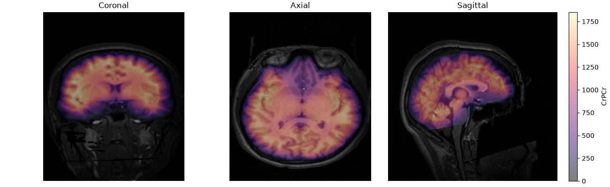

### Signal-weighted leakage

Not computed: T1w-space leakage requires the full T1w-space resampled metabolite maps (`--output-mrsi-t1w`), which weren't requested for this run. The alignment image above uses a separate, lightweight report-only resampling and doesn't imply this data is available.

## Template-space alignment

### Template-space alignment

Reference metabolite map (`CrPCr`) overlaid on the full-head `MNI152NLin2009cAsym` template at 5 mm.

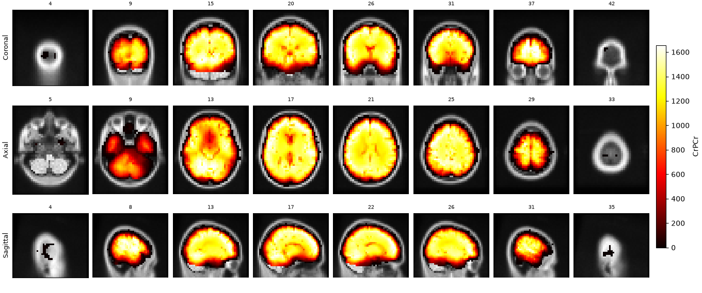

### Signal-weighted leakage

| metabolite | n_quality_voxels | total_signal_mass | leakage_signal_mass | leakage_fraction | leakage_percent |
| --- | --- | --- | --- | --- | --- |
| CrPCr | 73752 | 15010842.000 | 89485.297 | 0.006 | 0.596 |
| GPCPCh | 73875 | 4183460.750 | 29170.521 | 0.007 | 0.697 |
| GluGln | 73625 | 20428784.000 | 147303.656 | 0.007 | 0.721 |
| Ins | 73403 | 12725528.000 | 87774.406 | 0.007 | 0.690 |
| NAANAAG | 74278 | 23589286.000 | 149212.031 | 0.006 | 0.633 |

## Coverage

### MRSI anatomical coverage

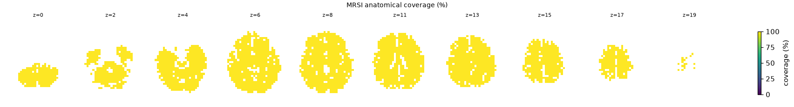

### Parcelwise CRLB quality (green reliable / red unreliable)

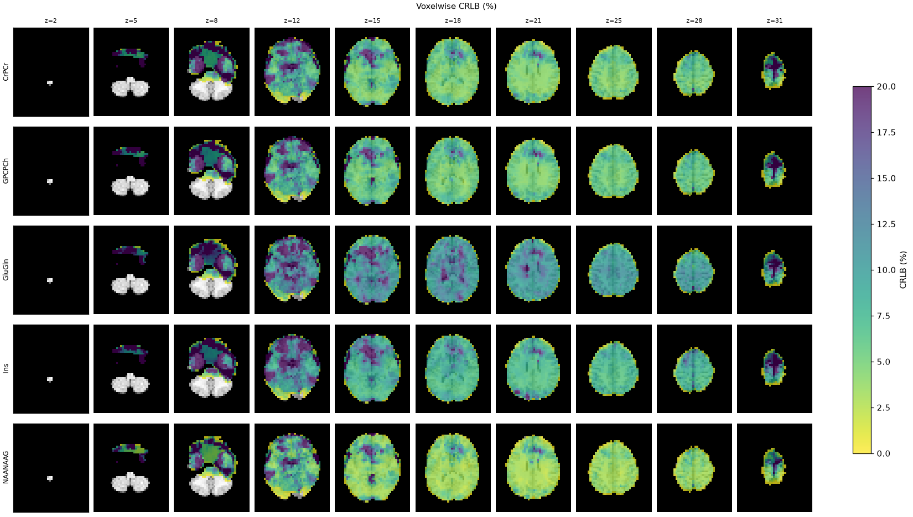

`qc_valid_fraction` is the fraction of a parcel's MRSI voxels that passed every per-voxel quality threshold in force for this run (CRLB ≤ 20.0%, SNR ≥ 4.0, linewidth ≤ 0.1), averaged over metabolites. Rows are ordered worst first.

| parcel_id | parcel_name | hemisphere | mean_crlb | qc_valid_fraction |
| --- | --- | --- | --- | --- |
| 2006 | ctx-rh-entorhinal | R | 26.900 | 0.000 |
| 2032 | ctx-rh-frontalpole | R | 417.267 | 0.143 |
| 1006 | ctx-lh-entorhinal | L | 163.415 | 0.169 |
| 46 | Right-Cerebellum-White-Matter | R | 16.588 | 0.274 |
| 2033 | ctx-rh-temporalpole | R | 155.200 | 0.329 |
| 1033 | ctx-lh-temporalpole | L | 119.692 | 0.338 |
| 18 | Left-Amygdala | L | 22.000 | 0.345 |
| 47 | Right-Cerebellum-Cortex | R | 31.257 | 0.367 |
| 7 | Left-Cerebellum-White-Matter | L | 13.315 | 0.390 |
| 8 | Left-Cerebellum-Cortex | L | 14.707 | 0.422 |
| 2019 | ctx-rh-parsorbitalis | R | 28.176 | 0.459 |
| 1009 | ctx-lh-inferiortemporal | L | 35.404 | 0.466 |
| 1032 | ctx-lh-frontalpole | L | 115.267 | 0.467 |
| 16 | Brain-Stem | NaN | 17.059 | 0.512 |
| 2011 | ctx-rh-lateraloccipital | R | 7.023 | 0.564 |
| 1027 | ctx-lh-rostralmiddlefrontal | L | 8.116 | 0.570 |
| 26 | Left-Accumbens-area | L | 89.433 | 0.633 |
| 1011 | ctx-lh-lateraloccipital | L | 7.805 | 0.655 |
| 2027 | ctx-rh-rostralmiddlefrontal | R | 15.281 | 0.686 |
| 2009 | ctx-rh-inferiortemporal | R | 28.685 | 0.737 |
| 1003 | ctx-lh-caudalmiddlefrontal | L | 6.733 | 0.750 |
| 1015 | ctx-lh-middletemporal | L | 24.200 | 0.759 |
| 1007 | ctx-lh-fusiform | L | 24.515 | 0.775 |
| 1012 | ctx-lh-lateralorbitofrontal | L | 15.264 | 0.783 |
| 2012 | ctx-rh-lateralorbitofrontal | R | 22.735 | 0.796 |
| 17 | Left-Hippocampus | L | 27.143 | 0.814 |
| 2026 | ctx-rh-rostralanteriorcingulate | R | 13.333 | 0.833 |
| 1028 | ctx-lh-superiorfrontal | L | 7.959 | 0.842 |
| 1016 | ctx-lh-parahippocampal | L | 12.114 | 0.843 |
| 60 | Right-VentralDC | R | 11.329 | 0.858 |
| 1022 | ctx-lh-postcentral | L | 6.559 | 0.863 |
| 53 | Right-Hippocampus | R | 27.496 | 0.864 |
| 1026 | ctx-lh-rostralanteriorcingulate | L | 29.400 | 0.873 |
| 54 | Right-Amygdala | R | 11.675 | 0.875 |
| 2007 | ctx-rh-fusiform | R | 17.431 | 0.897 |
| 1014 | ctx-lh-medialorbitofrontal | L | 24.898 | 0.902 |
| 1031 | ctx-lh-supramarginal | L | 6.697 | 0.904 |
| 50 | Right-Caudate | R | 10.030 | 0.910 |
| 11 | Left-Caudate | L | 10.021 | 0.916 |
| 2003 | ctx-rh-caudalmiddlefrontal | R | 7.645 | 0.917 |
| 2002 | ctx-rh-caudalanteriorcingulate | R | 11.283 | 0.917 |
| 2014 | ctx-rh-medialorbitofrontal | R | 15.082 | 0.918 |
| 2020 | ctx-rh-parstriangularis | R | 9.707 | 0.919 |
| 13 | Left-Pallidum | L | 11.500 | 0.920 |
| 1019 | ctx-lh-parsorbitalis | L | 7.117 | 0.923 |
| 1013 | ctx-lh-lingual | L | 7.418 | 0.925 |
| 2028 | ctx-rh-superiorfrontal | R | 7.425 | 0.926 |
| 2022 | ctx-rh-postcentral | R | 6.719 | 0.929 |
| 2024 | ctx-rh-precentral | R | 6.782 | 0.931 |
| 2031 | ctx-rh-supramarginal | R | 6.269 | 0.931 |
| 12 | Left-Putamen | L | 8.051 | 0.937 |
| 28 | Left-VentralDC | L | 13.208 | 0.938 |
| 2029 | ctx-rh-superiorparietal | R | 6.944 | 0.939 |
| 2015 | ctx-rh-middletemporal | R | 8.852 | 0.950 |
| 1024 | ctx-lh-precentral | L | 7.028 | 0.950 |
| 58 | Right-Accumbens-area | R | 14.400 | 0.950 |
| 1029 | ctx-lh-superiorparietal | L | 6.952 | 0.951 |
| 1008 | ctx-lh-inferiorparietal | L | 7.000 | 0.952 |
| 2 | Left-Cerebral-White-Matter | L | 9.650 | 0.953 |
| 1002 | ctx-lh-caudalanteriorcingulate | L | 9.525 | 0.958 |
| 1030 | ctx-lh-superiortemporal | L | 7.745 | 0.960 |
| 2013 | ctx-rh-lingual | R | 7.119 | 0.964 |
| 1017 | ctx-lh-paracentral | L | 7.353 | 0.967 |
| 1035 | ctx-lh-insula | L | 7.156 | 0.968 |
| 2017 | ctx-rh-paracentral | R | 7.119 | 0.969 |
| 2016 | ctx-rh-parahippocampal | R | 8.886 | 0.971 |
| 41 | Right-Cerebral-White-Matter | R | 8.019 | 0.972 |
| 2035 | ctx-rh-insula | R | 7.508 | 0.973 |
| 51 | Right-Putamen | R | 7.677 | 0.974 |
| 1018 | ctx-lh-parsopercularis | L | 7.141 | 0.976 |
| 52 | Right-Pallidum | R | 9.667 | 0.978 |
| 1025 | ctx-lh-precuneus | L | 6.205 | 0.984 |
| 1020 | ctx-lh-parstriangularis | L | 7.825 | 0.992 |
| 10 | Left-Thalamus | L | 7.504 | 0.992 |
| 49 | Right-Thalamus | R | 6.950 | 0.996 |
| 2030 | ctx-rh-superiortemporal | R | 6.786 | 0.997 |
| 2008 | ctx-rh-inferiorparietal | R | 6.339 | 0.998 |
| 1001 | ctx-lh-bankssts | L | 5.788 | 1.000 |
| 1005 | ctx-lh-cuneus | L | 6.938 | 1.000 |
| 1010 | ctx-lh-isthmuscingulate | L | 5.848 | 1.000 |
| 2005 | ctx-rh-cuneus | R | 6.965 | 1.000 |
| 2001 | ctx-rh-bankssts | R | 6.306 | 1.000 |
| 1034 | ctx-lh-transversetemporal | L | 6.000 | 1.000 |
| 1023 | ctx-lh-posteriorcingulate | L | 5.933 | 1.000 |
| 1021 | ctx-lh-pericalcarine | L | 7.600 | 1.000 |
| 2021 | ctx-rh-pericalcarine | R | 6.073 | 1.000 |
| 2018 | ctx-rh-parsopercularis | R | 7.993 | 1.000 |
| 2010 | ctx-rh-isthmuscingulate | R | 5.985 | 1.000 |
| 2023 | ctx-rh-posteriorcingulate | R | 5.936 | 1.000 |
| 2025 | ctx-rh-precuneus | R | 5.789 | 1.000 |
| 2034 | ctx-rh-transversetemporal | R | 5.691 | 1.000 |

## Parcellation

### Parcellation outlines (T1w space)

506 regions.

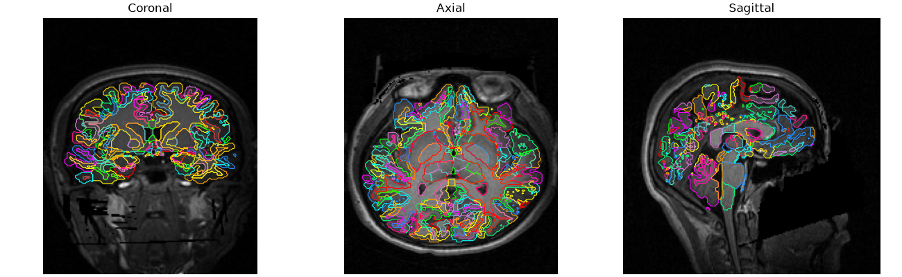

### Regional metabolites: chimeraLFMIHIFIFF-scale3

| subject | session | atlas | scale | parcel_id | parcel_name | hemisphere | metabolite | mean | median | std | weighted_mean | n_voxels | coverage | mean_snr | mean_linewidth | mean_crlb | mean_gm_fraction | mean_wm_fraction | mean_csf_fraction |
| --- | --- | --- | --- | --- | --- | --- | --- | --- | --- | --- | --- | --- | --- | --- | --- | --- | --- | --- | --- |
| sub-01 | ses-01 | chimeraLFMIHIFIFF | scale3 | 1 | ctx-rh-lateralorbitofrontal_1 | R | NAANAAG | 630.298828 | 456.964752 | 546.460449 | 680.328247 | 17 | 0.894737 | 9.647058 | 0.049353 | 5.823529 | 0.766510 | 0.074869 | 0.158621 |
| sub-01 | ses-01 | chimeraLFMIHIFIFF | scale3 | 1 | ctx-rh-lateralorbitofrontal_1 | R | GPCPCh | 195.250153 | 170.521088 | 81.458519 | 198.512375 | 16 | 0.842105 | 9.937500 | 0.050000 | 7.750000 | 0.794849 | 0.079548 | 0.125603 |
| sub-01 | ses-01 | chimeraLFMIHIFIFF | scale3 | 1 | ctx-rh-lateralorbitofrontal_1 | R | CrPCr | 518.341553 | 445.490265 | 272.058136 | 537.645020 | 17 | 0.894737 | 9.647058 | 0.049353 | 7.882353 | 0.766510 | 0.074869 | 0.158621 |
| sub-01 | ses-01 | chimeraLFMIHIFIFF | scale3 | 1 | ctx-rh-lateralorbitofrontal_1 | R | GluGln | 699.686279 | 621.933167 | 331.352112 | 733.446777 | 16 | 0.842105 | 9.875000 | 0.049125 | 11.875000 | 0.771795 | 0.079548 | 0.148657 |
| sub-01 | ses-01 | chimeraLFMIHIFIFF | scale3 | 1 | ctx-rh-lateralorbitofrontal_1 | R | Ins | 473.752930 | 422.292358 | 230.733734 | 483.350494 | 14 | 0.736842 | 10.428572 | 0.048714 | 13.642858 | 0.788276 | 0.090894 | 0.120830 |
| sub-01 | ses-01 | chimeraLFMIHIFIFF | scale3 | 2 | ctx-rh-lateralorbitofrontal_2 | R | NAANAAG | 1244.026001 | 1067.720703 | 542.604065 | 1335.750244 | 16 | 0.888889 | 10.562500 | 0.051312 | 6.312500 | 0.700640 | 0.108193 | 0.191166 |
| sub-01 | ses-01 | chimeraLFMIHIFIFF | scale3 | 2 | ctx-rh-lateralorbitofrontal_2 | R | GPCPCh | 300.121735 | 282.140564 | 91.731735 | 315.977356 | 16 | 0.888889 | 10.562500 | 0.051312 | 8.125000 | 0.700640 | 0.108193 | 0.191166 |
| sub-01 | ses-01 | chimeraLFMIHIFIFF | scale3 | 2 | ctx-rh-lateralorbitofrontal_2 | R | CrPCr | 967.416504 | 927.080566 | 336.448059 | 1028.187012 | 16 | 0.888889 | 10.562500 | 0.051312 | 8.812500 | 0.700640 | 0.108193 | 0.191166 |
| sub-01 | ses-01 | chimeraLFMIHIFIFF | scale3 | 2 | ctx-rh-lateralorbitofrontal_2 | R | GluGln | 1381.926025 | 1334.387939 | 487.172699 | 1472.389282 | 16 | 0.888889 | 10.562500 | 0.051312 | 11.062500 | 0.700640 | 0.108193 | 0.191166 |
| sub-01 | ses-01 | chimeraLFMIHIFIFF | scale3 | 2 | ctx-rh-lateralorbitofrontal_2 | R | Ins | 815.326965 | 792.523193 | 253.972672 | 861.919556 | 16 | 0.888889 | 10.562500 | 0.051312 | 13.187500 | 0.700640 | 0.108193 | 0.191166 |
| sub-01 | ses-01 | chimeraLFMIHIFIFF | scale3 | 3 | ctx-rh-lateralorbitofrontal_3 | R | NAANAAG | 621.122253 | 257.051270 | 569.969116 | 534.009705 | 3 | 0.333333 | 7.333333 | 0.045667 | 8.333333 | 0.430462 | 0.000000 | 0.517863 |
| sub-01 | ses-01 | chimeraLFMIHIFIFF | scale3 | 3 | ctx-rh-lateralorbitofrontal_3 | R | GPCPCh | 192.981369 | 102.995895 | 135.896729 | 173.323288 | 3 | 0.333333 | 7.333333 | 0.045667 | 10.333333 | 0.430462 | 0.000000 | 0.517863 |
| sub-01 | ses-01 | chimeraLFMIHIFIFF | scale3 | 3 | ctx-rh-lateralorbitofrontal_3 | R | CrPCr | 697.192932 | 697.192932 | 477.786407 | 537.930786 | 2 | 0.222222 | 9.000000 | 0.047500 | 5.500000 | 0.601327 | 0.000000 | 0.321161 |
| sub-01 | ses-01 | chimeraLFMIHIFIFF | scale3 | 3 | ctx-rh-lateralorbitofrontal_3 | R | GluGln | 806.283264 | 486.878296 | 480.235504 | 737.313232 | 3 | 0.333333 | 7.333333 | 0.045667 | 11.666667 | 0.430462 | 0.000000 | 0.517863 |
| sub-01 | ses-01 | chimeraLFMIHIFIFF | scale3 | 3 | ctx-rh-lateralorbitofrontal_3 | R | Ins | 542.843933 | 542.843933 | 374.277527 | 418.084747 | 2 | 0.222222 | 9.000000 | 0.047500 | 12.500000 | 0.601327 | 0.000000 | 0.321161 |
| sub-01 | ses-01 | chimeraLFMIHIFIFF | scale3 | 4 | ctx-rh-lateralorbitofrontal_4 | R | NAANAAG | 734.847595 | 637.379211 | 411.958191 | 742.525391 | 6 | 0.857143 | 11.166667 | 0.040500 | 4.500000 | 0.745394 | 0.003725 | 0.240836 |
| sub-01 | ses-01 | chimeraLFMIHIFIFF | scale3 | 4 | ctx-rh-lateralorbitofrontal_4 | R | GPCPCh | 206.235001 | 199.953369 | 88.023026 | 209.678482 | 6 | 0.857143 | 11.166667 | 0.040500 | 6.666667 | 0.745394 | 0.003725 | 0.240836 |
| sub-01 | ses-01 | chimeraLFMIHIFIFF | scale3 | 4 | ctx-rh-lateralorbitofrontal_4 | R | CrPCr | 636.945801 | 601.967957 | 308.103729 | 649.978760 | 6 | 0.857143 | 11.166667 | 0.040500 | 6.333333 | 0.745394 | 0.003725 | 0.240836 |
| sub-01 | ses-01 | chimeraLFMIHIFIFF | scale3 | 4 | ctx-rh-lateralorbitofrontal_4 | R | GluGln | 1184.965576 | 1151.621460 | 424.882111 | 1165.482178 | 5 | 0.714286 | 12.000000 | 0.039000 | 10.000000 | 0.812097 | 0.004470 | 0.183433 |
| sub-01 | ses-01 | chimeraLFMIHIFIFF | scale3 | 4 | ctx-rh-lateralorbitofrontal_4 | R | Ins | 525.538757 | 498.606323 | 254.856857 | 535.244141 | 6 | 0.857143 | 11.166667 | 0.040500 | 9.500000 | 0.745394 | 0.003725 | 0.240836 |
| sub-01 | ses-01 | chimeraLFMIHIFIFF | scale3 | 5 | ctx-rh-parsorbitalis_1 | R | NAANAAG | 1144.217407 | 1240.765381 | 464.629700 | 1267.409790 | 9 | 0.642857 | 9.444445 | 0.066444 | 8.555555 | 0.789768 | 0.000000 | 0.210232 |
| sub-01 | ses-01 | chimeraLFMIHIFIFF | scale3 | 5 | ctx-rh-parsorbitalis_1 | R | GPCPCh | 283.328186 | 305.798828 | 70.225548 | 296.280029 | 8 | 0.571429 | 10.000000 | 0.069500 | 9.000000 | 0.810317 | 0.000000 | 0.189683 |
| sub-01 | ses-01 | chimeraLFMIHIFIFF | scale3 | 5 | ctx-rh-parsorbitalis_1 | R | CrPCr | 935.324890 | 1065.844482 | 299.441833 | 994.677002 | 7 | 0.500000 | 10.428572 | 0.068429 | 9.000000 | 0.785261 | 0.000000 | 0.214739 |
| sub-01 | ses-01 | chimeraLFMIHIFIFF | scale3 | 5 | ctx-rh-parsorbitalis_1 | R | GluGln | 1382.558716 | 1575.562378 | 489.724335 | 1509.057495 | 9 | 0.642857 | 9.444445 | 0.066444 | 11.555555 | 0.789768 | 0.000000 | 0.210232 |
| sub-01 | ses-01 | chimeraLFMIHIFIFF | scale3 | 5 | ctx-rh-parsorbitalis_1 | R | Ins | 893.044312 | 869.093872 | 93.666908 | 905.324219 | 5 | 0.357143 | 11.400000 | 0.063800 | 12.800000 | 0.828909 | 0.000000 | 0.171091 |
| sub-01 | ses-01 | chimeraLFMIHIFIFF | scale3 | 6 | ctx-rh-frontalpole_1 | R | NAANAAG | 216.626358 | 216.626358 | 0.000000 | 216.626373 | 1 | 0.250000 | 5.000000 | 0.065000 | 20.000000 | 0.519394 | 0.000000 | 0.480606 |
| sub-01 | ses-01 | chimeraLFMIHIFIFF | scale3 | 6 | ctx-rh-frontalpole_1 | R | GPCPCh | NaN | NaN | NaN | NaN | 0 | 0.000000 | NaN | NaN | NaN | NaN | NaN | NaN |
| sub-01 | ses-01 | chimeraLFMIHIFIFF | scale3 | 6 | ctx-rh-frontalpole_1 | R | CrPCr | NaN | NaN | NaN | NaN | 0 | 0.000000 | NaN | NaN | NaN | NaN | NaN | NaN |
| sub-01 | ses-01 | chimeraLFMIHIFIFF | scale3 | 6 | ctx-rh-frontalpole_1 | R | GluGln | 346.515808 | 346.515808 | 0.000000 | 346.515808 | 1 | 0.250000 | 5.000000 | 0.065000 | 19.000000 | 0.519394 | 0.000000 | 0.480606 |
| sub-01 | ses-01 | chimeraLFMIHIFIFF | scale3 | 6 | ctx-rh-frontalpole_1 | R | Ins | NaN | NaN | NaN | NaN | 0 | 0.000000 | NaN | NaN | NaN | NaN | NaN | NaN |
| sub-01 | ses-01 | chimeraLFMIHIFIFF | scale3 | 7 | ctx-rh-medialorbitofrontal_1 | R | NAANAAG | 1281.047485 | 1128.151001 | 632.074951 | 1338.772827 | 12 | 1.000000 | 13.000000 | 0.056333 | 5.250000 | 0.694322 | 0.035617 | 0.270061 |
| sub-01 | ses-01 | chimeraLFMIHIFIFF | scale3 | 7 | ctx-rh-medialorbitofrontal_1 | R | GPCPCh | 324.675171 | 338.032745 | 126.929207 | 334.095154 | 12 | 1.000000 | 13.000000 | 0.056333 | 7.083333 | 0.694322 | 0.035617 | 0.270061 |
| sub-01 | ses-01 | chimeraLFMIHIFIFF | scale3 | 7 | ctx-rh-medialorbitofrontal_1 | R | CrPCr | 1019.077332 | 980.421326 | 429.041840 | 1056.072266 | 12 | 1.000000 | 13.000000 | 0.056333 | 7.500000 | 0.694322 | 0.035617 | 0.270061 |
| sub-01 | ses-01 | chimeraLFMIHIFIFF | scale3 | 7 | ctx-rh-medialorbitofrontal_1 | R | GluGln | 1585.049683 | 1573.024902 | 646.520874 | 1645.367065 | 10 | 0.833333 | 13.300000 | 0.054600 | 10.100000 | 0.636926 | 0.039120 | 0.323954 |
| sub-01 | ses-01 | chimeraLFMIHIFIFF | scale3 | 7 | ctx-rh-medialorbitofrontal_1 | R | Ins | 865.067139 | 828.930237 | 342.778290 | 895.638794 | 12 | 1.000000 | 13.000000 | 0.056333 | 9.750000 | 0.694322 | 0.035617 | 0.270061 |
| sub-01 | ses-01 | chimeraLFMIHIFIFF | scale3 | 8 | ctx-rh-medialorbitofrontal_2 | R | NAANAAG | 388.223907 | 288.539520 | 309.696838 | 403.031586 | 10 | 1.000000 | 11.700000 | 0.048400 | 5.600000 | 0.551843 | 0.046457 | 0.389340 |
| sub-01 | ses-01 | chimeraLFMIHIFIFF | scale3 | 8 | ctx-rh-medialorbitofrontal_2 | R | GPCPCh | 155.074188 | 141.352188 | 79.323509 | 159.400040 | 10 | 1.000000 | 11.700000 | 0.048400 | 7.800000 | 0.551843 | 0.046457 | 0.389340 |
| sub-01 | ses-01 | chimeraLFMIHIFIFF | scale3 | 8 | ctx-rh-medialorbitofrontal_2 | R | CrPCr | 377.013489 | 320.113159 | 243.999268 | 391.336945 | 10 | 1.000000 | 11.700000 | 0.048400 | 7.600000 | 0.551843 | 0.046457 | 0.389340 |
| sub-01 | ses-01 | chimeraLFMIHIFIFF | scale3 | 8 | ctx-rh-medialorbitofrontal_2 | R | GluGln | 517.571716 | 430.455475 | 263.876587 | 534.123535 | 9 | 0.900000 | 11.666667 | 0.045889 | 12.444445 | 0.550682 | 0.051619 | 0.383965 |
| sub-01 | ses-01 | chimeraLFMIHIFIFF | scale3 | 8 | ctx-rh-medialorbitofrontal_2 | R | Ins | 333.213348 | 292.206116 | 197.287720 | 344.769409 | 10 | 1.000000 | 11.700000 | 0.048400 | 10.700000 | 0.551843 | 0.046457 | 0.389340 |
| sub-01 | ses-01 | chimeraLFMIHIFIFF | scale3 | 9 | ctx-rh-medialorbitofrontal_3 | R | NAANAAG | 450.511658 | 381.321075 | 274.666840 | 394.577454 | 13 | 0.928571 | 10.230769 | 0.042769 | 5.153846 | 0.624743 | 0.166892 | 0.207117 |
| sub-01 | ses-01 | chimeraLFMIHIFIFF | scale3 | 9 | ctx-rh-medialorbitofrontal_3 | R | GPCPCh | 159.792419 | 149.397308 | 60.070553 | 148.715439 | 13 | 0.928571 | 10.230769 | 0.042769 | 7.692307 | 0.624743 | 0.166892 | 0.207117 |
| sub-01 | ses-01 | chimeraLFMIHIFIFF | scale3 | 9 | ctx-rh-medialorbitofrontal_3 | R | CrPCr | 430.992737 | 389.962280 | 213.507919 | 390.926575 | 13 | 0.928571 | 10.230769 | 0.042769 | 7.846154 | 0.624743 | 0.166892 | 0.207117 |
| sub-01 | ses-01 | chimeraLFMIHIFIFF | scale3 | 9 | ctx-rh-medialorbitofrontal_3 | R | GluGln | 534.949768 | 513.074280 | 212.996231 | 508.115082 | 12 | 0.857143 | 10.666667 | 0.044333 | 11.666667 | 0.619643 | 0.154628 | 0.224376 |
| sub-01 | ses-01 | chimeraLFMIHIFIFF | scale3 | 9 | ctx-rh-medialorbitofrontal_3 | R | Ins | 362.288910 | 344.122375 | 152.936981 | 327.380676 | 12 | 0.857143 | 10.500000 | 0.041917 | 12.000000 | 0.676804 | 0.180799 | 0.141043 |
| sub-01 | ses-01 | chimeraLFMIHIFIFF | scale3 | 10 | ctx-rh-parstriangularis_1 | R | NAANAAG | 2050.917969 | 2026.731079 | 425.156616 | 2072.838623 | 6 | 1.000000 | 12.333333 | 0.045000 | 6.333333 | 0.615453 | 0.098005 | 0.286543 |
| sub-01 | ses-01 | chimeraLFMIHIFIFF | scale3 | 10 | ctx-rh-parstriangularis_1 | R | GPCPCh | 386.035248 | 384.524506 | 73.625259 | 389.555573 | 6 | 1.000000 | 12.333333 | 0.045000 | 8.166667 | 0.615453 | 0.098005 | 0.286543 |
| sub-01 | ses-01 | chimeraLFMIHIFIFF | scale3 | 10 | ctx-rh-parstriangularis_1 | R | CrPCr | 1233.269165 | 1260.648682 | 279.599976 | 1246.294922 | 6 | 1.000000 | 12.333333 | 0.045000 | 8.000000 | 0.615453 | 0.098005 | 0.286543 |
| sub-01 | ses-01 | chimeraLFMIHIFIFF | scale3 | 10 | ctx-rh-parstriangularis_1 | R | GluGln | 1754.313110 | 1812.510498 | 440.012878 | 1774.429688 | 6 | 1.000000 | 12.333333 | 0.045000 | 12.333333 | 0.615453 | 0.098005 | 0.286543 |
| sub-01 | ses-01 | chimeraLFMIHIFIFF | scale3 | 10 | ctx-rh-parstriangularis_1 | R | Ins | 1035.241089 | 1057.267578 | 239.531540 | 1046.763062 | 6 | 1.000000 | 12.333333 | 0.045000 | 10.166667 | 0.615453 | 0.098005 | 0.286543 |

## Connectivity

### Connectivity matrix (spearman)

## MRSinMRS

| Parameter | Value | Unit |
| --- | --- | --- |
| AcquisitionDurationMS | 389 | ms |
| Averages | 1 |  |
| AveragingMode | N.A. |  |
| CoilElements | N.A. (synthetic) |  |
| CombinedMetabolites | tNAA (NAA+NAAG), tCr (Cr+PCr), Cho (GPC+PCh), Ins (mI), Glx (Glu+Gln) |  |
| CompressedSensingAccelerationFactor | N.A. (synthetic) |  |
| DataProcessing | Model-synthesized signal (3D U-Net trained on real template subjects); no k-space reconstruction |  |
| DeltaFrequencyPPM | 0.0 | ppm |
| Dimension | 3D |  |
| FIDPointsVectorSize | 512 |  |
| FOV | 220 x 220 x 130 | mm |
| FlipAngle | 45.0 | ° |
| MagneticFieldStrength | 3.0 | T |
| MatrixSize | 44 x 44 x 25 |  |
| Measurements | 1 |  |
| MetaboliteBasisSetLCModel | NAA, NAAG, Cr, PCr, GPC, PCh, mI, sI, Glu, Gln, Lac, GABA, GSH, Tau, Asp, Ala |  |
| Note | SynthMRSI-Project is a synthetic dataset: real T1w anatomicals paired with model-synthesized MRSI metabolite signal (3D U-Net; see MRSIPrep manuscript, Validation Datasets). No real MRSI acquisition underlies these values -- numeric geometry/timing fields (TE, RepetitionTime, FOV, resolution, matrix size, field strength, etc.) record the acquisition protocol the synthetic signal generation was matched to; fields describing a specific real pulse sequence, reconstruction, or hardware are marked N.A. since none was used. |  |
| Orientation | Transverse |  |
| PhaseEncoding | N.A. (synthetic) |  |
| PreparationScans | N.A. (synthetic) |  |
| QualityMetrics | SNR, CRLB, FWHM (synthesized, not derived from spectral fitting) |  |
| Quantification | N.A. (synthetic; not derived from spectral fitting) |  |
| RFCoils | N.A. (synthetic) |  |
| RemoveOversampling | N.A. |  |
| RepetitionTime | 0.457 | s |
| ResolutionMM3 | 5 x 5 x 5.2 | mm |
| RotationDeg | -0.79 | ° |
| SaturationBands | N.A. (synthetic) |  |
| Scanner | N.A. (synthetic; no scanner) |  |
| Sequence | N.A. (synthetic; not acquired with a real MRSI sequence) |  |
| ShimMode | N.A. (synthetic) |  |
| SlabThicknessMM | 95 | mm |
| Slabs | 1 |  |
| SpectralBandwidthHz | 1320 | Hz |
| SpectralSuppr | N.A. (synthetic) |  |
| TE | 0.78 | s |
| WaterReferenceFIDPoints | 512 |  |
| WaterReferenceFlipAngle | 45.0 | ° |
| WaterReferenceResolutionMM3 | 10.0 x 10.0 x 10.0 | mm |
| WaterReferenceTE | 0.72 | s |
| WaterReferenceTR | 0.46 | s |
| WaterSuppr | N.A. (synthetic) |  |
| WaterSupprBWHz | N.A. (synthetic) | Hz |

## PrepParams

### Processing parameters

| Parameter | Value |
| --- | --- |
| Nucleus | 1H |
| Tissue backend | synthseg-fast |
| Registration backend | ants |
| Registration T1w target | brain-csf |
| Normalization | simple |
| Output spaces | MNI152NLin2009cAsym |
| Parcellation mode | chimera |
| Atlas | chimera-LFMIHIFIS_scale3 |
| SNR min | 4.0 |
| Linewidth max | 0.1 |
| CRLB max | 20.0 |
| Biharmonic spike filtering | True |
| Spike percentile | 99.0 |
| PVC disabled | False |
| T1 saturation correction | none |
| Connectivity | True |
| nproc x nthreads | 1 x 12 |

### Pipeline stages

Validate inputs → Tissue segmentation → Anatomical prep → MRSI preprocessing → Registration → Tissue probability maps → Tissue QC → Partial volume correction → Resampling → Leakage QC → SynthSeg parcellation QC → Parcellation → Regional extraction → Connectivity → Metabolite profiles → Reports

## Runtime

### Per-step duration

nproc: `1`  |  nthreads: `12`

Excludes this report-generation step's own duration (not yet known while it's still running) and any time spent before this recording's pipeline started (e.g. queued behind other recordings under `--nproc`).

PROC computed this run  ·  REUSED existing outputs reused (re-run with `--overwrite` to recompute)  ·  N/A not requested by this configuration  ·  FAILED raised an error

| Step | Outcome | Duration | % of total |
| --- | --- | --- | --- |
| Tissue segmentation | PROC | 56.6s | 1.2% |
| Anatomical preparation | PROC | 0.3s | 0.0% |
| MRSI preprocessing | PROC | 6.4s | 0.1% |
| MRSI-to-T1w registration | PROC | 1m 01.5s | 1.3% |
| T1w-to-template registration | PROC | 1m 43.2s | 2.2% |
| Tissue probability maps in MRSI space | PROC | 0.6s | 0.0% |
| Partial volume correction | PROC | 0.2s | 0.0% |
| Resampling MRSI maps to T1w/MNI space | PROC | 7.2s | 0.2% |
| Signal leakage QC | PROC | 0.0s | 0.0% |
| SynthSeg parcellation and QC | REUSED | 2.3s | 0.0% |
| Parcellation | PROC | 1h 13m 17.2s | 94.6% |
| Regional metabolite extraction | PROC | 3.3s | 0.1% |
| Regional metabolic profiles and connectivity | PROC | 8.8s | 0.2% |
| T1 saturation correction   --t1-correction none | N/A | - | - |
| Total (through report generation) |  | 1h 17m 27.4s | 100.0% |

## Outputs

ses-01/
├── anat/
│   └── synthseg/
│       ├── sub-01_ses-01_atlas-synthseg_desc-fastGMWM.tsv
│       ├── sub-01_ses-01_atlas-synthseg_desc-parcelqc.tsv
│       ├── sub-01_ses-01_space-mrsi_atlas-chimeraLFMIHIFIFF_scale-scale3_desc-regional_metabolites.tsv
│       ├── sub-01_ses-01_space-mrsi_atlas-synthseg_desc-fastGMWM_dseg.nii.gz
│       ├── sub-01_ses-01_space-T1w_atlas-synthseg_desc-fastGMWM_dseg.nii.gz
│       ├── sub-01_ses-01_space-T1w_desc-brainCSF_T1w.nii.gz
│       ├── sub-01_ses-01_space-T1w_desc-brainCSFmask_mask.nii.gz
│       ├── sub-01_ses-01_space-T1w_desc-synthsegBrain_mask.nii.gz
│       ├── sub-01_ses-01_space-T1w_desc-synthsegBrain_T1w.nii.gz
│       ├── sub-01_ses-01_space-T1w_desc-synthsegFastInput_T1w.nii.gz
│       └── sub-01_ses-01_space-T1w_desc-synthsegParcFast_dseg.nii.gz
├── confounds/
│   ├── sub-01_ses-01_desc-leakageqc.tsv
│   ├── sub-01_ses-01_desc-mrsiqc.tsv
│   ├── sub-01_ses-01_space-MNI152NLin2009cAsym_res-5_desc-fwhm_mrsi.nii.gz
│   ├── sub-01_ses-01_space-MNI152NLin2009cAsym_res-5_desc-snr_mrsi.nii.gz
│   ├── sub-01_ses-01_space-MNI152NLin2009cAsym_res-5_met-CrPCr_desc-crlb_mrsi.nii.gz
│   ├── sub-01_ses-01_space-MNI152NLin2009cAsym_res-5_met-GluGln_desc-crlb_mrsi.nii.gz
│   ├── sub-01_ses-01_space-MNI152NLin2009cAsym_res-5_met-GPCPCh_desc-crlb_mrsi.nii.gz
│   ├── sub-01_ses-01_space-MNI152NLin2009cAsym_res-5_met-Ins_desc-crlb_mrsi.nii.gz
│   ├── sub-01_ses-01_space-MNI152NLin2009cAsym_res-5_met-NAANAAG_desc-crlb_mrsi.nii.gz
│   ├── sub-01_ses-01_space-mrsi_desc-brain_mask.nii.gz
│   ├── sub-01_ses-01_space-mrsi_label-CSF_probseg.nii.gz
│   ├── sub-01_ses-01_space-mrsi_label-GM_probseg.nii.gz
│   ├── sub-01_ses-01_space-mrsi_label-WM_probseg.nii.gz
│   ├── sub-01_ses-01_space-mrsi_met-CrPCr_desc-qcmask_mask.nii.gz
│   ├── sub-01_ses-01_space-mrsi_met-CrPCr_desc-spikemask_mask.nii.gz
│   ├── sub-01_ses-01_space-mrsi_met-GluGln_desc-qcmask_mask.nii.gz
│   ├── sub-01_ses-01_space-mrsi_met-GluGln_desc-spikemask_mask.nii.gz
│   ├── sub-01_ses-01_space-mrsi_met-GPCPCh_desc-qcmask_mask.nii.gz
│   ├── sub-01_ses-01_space-mrsi_met-GPCPCh_desc-spikemask_mask.nii.gz
│   ├── sub-01_ses-01_space-mrsi_met-Ins_desc-qcmask_mask.nii.gz
│   ├── sub-01_ses-01_space-mrsi_met-Ins_desc-spikemask_mask.nii.gz
│   ├── sub-01_ses-01_space-mrsi_met-NAANAAG_desc-qcmask_mask.nii.gz
│   ├── sub-01_ses-01_space-mrsi_met-NAANAAG_desc-spikemask_mask.nii.gz
│   ├── sub-01_ses-01_space-orig_desc-fwhm_mrsi.nii.gz
│   ├── sub-01_ses-01_space-orig_desc-snr_mrsi.nii.gz
│   ├── sub-01_ses-01_space-orig_met-CrPCr_desc-crlb_mrsi.nii.gz
│   ├── sub-01_ses-01_space-orig_met-GluGln_desc-crlb_mrsi.nii.gz
│   ├── sub-01_ses-01_space-orig_met-GPCPCh_desc-crlb_mrsi.nii.gz
│   ├── sub-01_ses-01_space-orig_met-Ins_desc-crlb_mrsi.nii.gz
│   ├── sub-01_ses-01_space-orig_met-NAANAAG_desc-crlb_mrsi.nii.gz
│   ├── sub-01_ses-01_space-T1w_label-CSF_probseg.nii.gz
│   ├── sub-01_ses-01_space-T1w_label-GM_probseg.nii.gz
│   └── sub-01_ses-01_space-T1w_label-WM_probseg.nii.gz
├── connectivity/
│   ├── sub-01_ses-01_atlas-chimeraLFMIHIFIFF_scale3_npert-50_filt-biharmonic_pvcorr_GM_desc-connectivity_mrsi.npz
│   ├── sub-01_ses-01_atlas-chimeraLFMIHIFIFF_scale3_npert-50_filt-biharmonic_pvcorr_GM_desc-connectivity_mrsi.tsv
│   ├── sub-01_ses-01_atlas-chimeraLFMIHIFIFF_scale3_npert-50_filt-biharmonic_pvcorr_GM_desc-edges_mrsi.tsv
│   ├── sub-01_ses-01_atlas-chimeraLFMIHIFIFF_scale3_npert-50_filt-biharmonic_pvcorr_GM_desc-metabolicprofiles_mrsi.npz
│   └── sub-01_ses-01_atlas-chimeraLFMIHIFIFF_scale3_npert-50_filt-biharmonic_pvcorr_GM_desc-nodes_mrsi.tsv
├── logs/
│   └── sub-01_ses-01_desc-mrsiprep_log.txt
├── mrsi/
│   ├── mni/
│   │   ├── sub-01_ses-01_space-MNI152NLin2009cAsym_res-5_met-CrPCr_desc-signal_mrsi.nii.gz
│   │   ├── sub-01_ses-01_space-MNI152NLin2009cAsym_res-5_met-GluGln_desc-signal_mrsi.nii.gz
│   │   ├── sub-01_ses-01_space-MNI152NLin2009cAsym_res-5_met-GPCPCh_desc-signal_mrsi.nii.gz
│   │   ├── sub-01_ses-01_space-MNI152NLin2009cAsym_res-5_met-Ins_desc-signal_mrsi.nii.gz
│   │   └── sub-01_ses-01_space-MNI152NLin2009cAsym_res-5_met-NAANAAG_desc-signal_mrsi.nii.gz
│   ├── orig/
│   │   ├── sub-01_ses-01_space-mrsi_desc-reference_mrsi.nii.gz
│   │   ├── sub-01_ses-01_space-mrsi_met-CrPCr_desc-signal_mrsi.nii.gz
│   │   ├── sub-01_ses-01_space-mrsi_met-CrPCr_desc-signalspikefilt_mrsi.nii.gz
│   │   ├── sub-01_ses-01_space-mrsi_met-GluGln_desc-signal_mrsi.nii.gz
│   │   ├── sub-01_ses-01_space-mrsi_met-GluGln_desc-signalspikefilt_mrsi.nii.gz
│   │   ├── sub-01_ses-01_space-mrsi_met-GPCPCh_desc-signal_mrsi.nii.gz
│   │   ├── sub-01_ses-01_space-mrsi_met-GPCPCh_desc-signalspikefilt_mrsi.nii.gz
│   │   ├── sub-01_ses-01_space-mrsi_met-Ins_desc-signal_mrsi.nii.gz
│   │   ├── sub-01_ses-01_space-mrsi_met-Ins_desc-signalspikefilt_mrsi.nii.gz
│   │   ├── sub-01_ses-01_space-mrsi_met-NAANAAG_desc-signal_mrsi.nii.gz
│   │   └── sub-01_ses-01_space-mrsi_met-NAANAAG_desc-signalspikefilt_mrsi.nii.gz
│   ├── orig-pvc/
│   │   ├── sub-01_ses-01_space-mrsi_met-CrPCr_desc-signalpvc_mrsi.nii.gz
│   │   ├── sub-01_ses-01_space-mrsi_met-GluGln_desc-signalpvc_mrsi.nii.gz
│   │   ├── sub-01_ses-01_space-mrsi_met-GPCPCh_desc-signalpvc_mrsi.nii.gz
│   │   ├── sub-01_ses-01_space-mrsi_met-Ins_desc-signalpvc_mrsi.nii.gz
│   │   └── sub-01_ses-01_space-mrsi_met-NAANAAG_desc-signalpvc_mrsi.nii.gz
│   └── parcel/
│       └── sub-01_ses-01_atlas-chimeraLFMIHIFIFF_scalescale3_desc-GMmetprofiles_mrsi.npz
└── transforms/
    ├── anat/
    │   ├── sub-01_ses-01_desc-t1w_to_mni.affine.mat
    │   ├── sub-01_ses-01_desc-t1w_to_mni.affine_inv.mat
    │   ├── sub-01_ses-01_desc-t1w_to_mni.syn.nii.gz
    │   └── sub-01_ses-01_desc-t1w_to_mni.syn_inv.nii.gz
    └── mrsi/
        ├── sub-01_ses-01_desc-mrsi_to_t1w.affine.mat
        ├── sub-01_ses-01_desc-mrsi_to_t1w.affine_inv.mat
        ├── sub-01_ses-01_desc-mrsi_to_t1w.syn.nii.gz
        └── sub-01_ses-01_desc-mrsi_to_t1w.syn_inv.nii.gz

## Citations

MRSIPrep: see `CITATION.cff` in the MRSIPrep repository for how to cite this software.

MRSI acquisition reporting follows the MRSinMRS minimum reporting standard (Lin et al. 2021).
