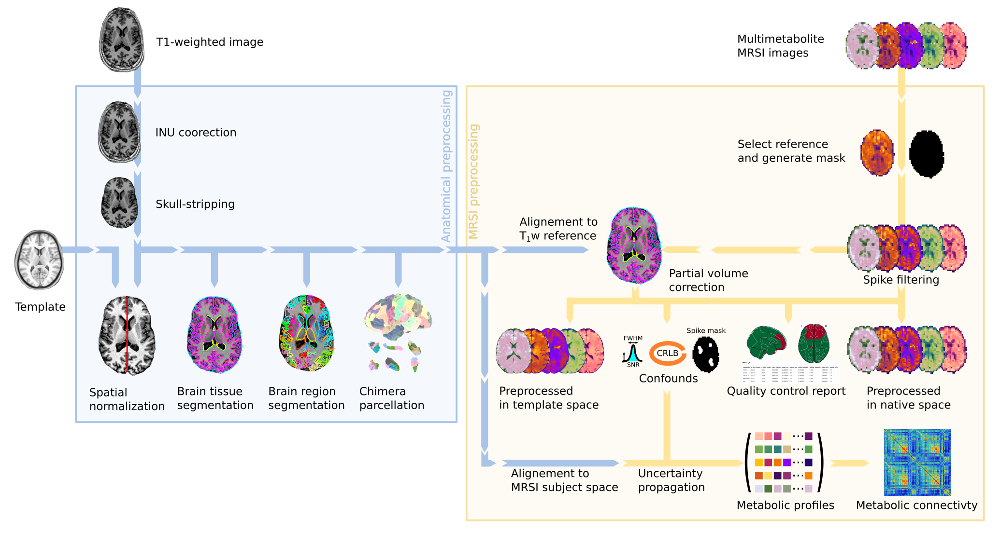

# *MRSIPrep*: A Robust Preprocessing Pipeline for Whole-Brain MRSI Data

*MRSIPrep* is a preprocessing and derivative-generation pipeline for already
quantified whole-brain MRSI maps, run as a BIDS App via Docker.


[](https://github.com/MRSI-Psychosis-UP/MRSIPrep/actions/workflows/e2e-mni-norm.yml)
[](https://github.com/MRSI-Psychosis-UP/MRSIPrep/actions/workflows/e2e-parc-con.yml)
[](https://codecov.io/gh/MRSI-Psychosis-UP/MRSIPrep)
[](https://mrsiprep.readthedocs.io/en/stable/)
[](https://app.codacy.com/gh/MRSI-Psychosis-UP/MRSIPrep/dashboard?utm_source=gh&utm_medium=referral&utm_content=&utm_campaign=Badge_grade)
[](https://doi.org/10.5281/zenodo.21477047)
[](https://hub.docker.com/r/mrsiup/mrsiprep)
[](https://pypi.org/project/mrsiprep/)
[](https://github.com/MRSI-Psychosis-UP/MRSIPrep/blob/main/LICENSE)

## About

*MRSIPrep* is a magnetic resonance spectroscopic imaging (MRSI) data
preprocessing pipeline that is designed to provide an easily accessible,
robust interface requiring minimal user input, while providing easily
interpretable and comprehensive quality-control reporting. It performs basic
processing steps (registration to anatomical and template space, tissue
segmentation, partial-volume correction, atlas projection, etc.) on already
quantified whole-brain MRSI maps, providing outputs that can be easily
submitted to a variety of group-level analyses, including
[voxel-based analysis](https://github.com/MRSI-Psychosis-UP/VLAD), regional
statistics, and metabolic connectivity.
It is derived from the implementation in `MRSI-Metabolic-Connectome` and preserves the CHUV
academic non-commercial research license.

Every report includes the acquisition's [MRSinMRS](https://pubmed.ncbi.nlm.nih.gov/33559967/)
minimum-reporting-standard sequence parameters (read from an optional
`mrsinmrs.json` at the BIDS root) and a citation section, so results are
easy to trace back to both the software and the acquisition protocol used.
Published-study parameter sets can be reproduced directly with
`--config-preset <name>` (see `--list-presets`); the report then credits
the source publication.



## Test Dataset

A small, public, synthetic MRSI dataset (**SynthMRSI-Project**) is
available for anyone to download and run through MRSIPrep themselves,
without needing access to real MRSI acquisitions. It pairs real T1w
anatomical images (subsetted from two CC0 OpenNeuro datasets) with
model-synthesized MRSI signal and empirical CRLB/SNR/FWHM quality maps,
following MRSIPrep's own raw-MRSI-input convention
(`derivatives/mrsi-orig/`).

Published on Zenodo:
[10.5281/zenodo.21477047](https://doi.org/10.5281/zenodo.21477047) (CC0).
See [PUBLIC_DATASET.md](https://github.com/MRSI-Psychosis-UP/MRSIPrep/blob/main/PUBLIC_DATASET.md)
in the repository for full download and usage instructions. This dataset is
also the fixture for MRSIPrep's own automated end-to-end pipeline test.

## What it uses

Every dependency below is pinned to a fixed version inside the
distributed Docker image (`mrsiprep`'s own version and each external
tool's resolved binary path are recorded in the per-recording provenance
output):

- **[Nipype](https://nipype.readthedocs.io/)** (v1.11.0) as the workflow engine: each
  subject/session is a cached, per-step Nipype workflow, so a rerun of an
  already-processed recording skips finished steps instead of recomputing
  them.
- **[ANTs](http://stnava.github.io/ANTs/)** (v2.6.5) for MRSI↔T1w and T1w↔MNI registration.
- **[FreeSurfer](https://surfer.nmr.mgh.harvard.edu/)** (v8.2.0; `mri_synthseg`, `recon-all`, `mri_vol2vol`) for brain
  extraction, cortical/subcortical parcellation, and surface reconstruction.
- **[FSL](https://fsl.fmrib.ox.ac.uk/fsl/fslwiki) FAST** (v6.0.7.22) for tissue-class probability segmentation.
- **[PETPVC](https://github.com/UCL/PETPVC)** for partial-volume correction of MRSI maps.
- **[Chimera](https://github.com/connectomicslab/chimera)** (v0.3.1) for multi-atlas cortical/subcortical parcellation
  fusion.
- **[TemplateFlow](https://www.templateflow.org/)** for the
  MNI152NLin2009cAsym reference template MRSIPrep normalizes into
  (pre-fetched into the container, so runs stay offline).

## Pipelines

Every run performs the same core processing: MRSI spike filtering and
quality masking, tissue segmentation, PETPVC partial-volume correction
(`--no-pvc` to disable), MRSI↔T1w↔MNI registration, resampling to the
requested output spaces, regional metabolite extraction, and per-parcel
metabolic profile estimation.

`--parcellation-mode` selects how the brain is parcellated, and is the main
control over how much work a run does:

- **`synthseg`** (default): SynthSeg cortical/subcortical labels. No Chimera,
  no `recon-all` — the fast path, and enough for anatomical coverage and CRLB
  reporting.
- **`chimera`**: Chimera multi-atlas fusion. Requires `recon-all` and a
  FreeSurfer licence.
- **`atlas`**: a bundled or custom standardized MNI-space atlas, warped into
  subject space. No FreeSurfer licence needed.

`chimera` and `atlas` accept comma-separated lists, building several
parcellations from a single preprocessing pass (see
[Parcellation and Connectivity](usage_parcellation.md)). The metabolic
connectivity matrix is a separate opt-in, `--write-connectivity`.

Other behaviour — tissue backend, PVC, T1 saturation correction, output
spaces, and the acquired nucleus — is controlled independently by its own
flag, so any combination is available.

## Design Principles

MRSIPrep was designed according to four main principles: reproducibility,
modularity, transparency, and analysis agnosticism.

### Reproducibility

The framework is distributed as open-source software and can be executed in
containerized environments to minimize differences across computing
platforms.

### Modularity

Each processing stage is implemented as an independent module, allowing
users to enable, disable, or replace specific steps according to their
acquisition protocol and scientific question.

### Transparency

MRSIPrep generates automated quality-control reports summarizing spatial
registration, metabolite coverage, voxel-level quality metrics, tissue
composition, and atlas projection.

### Analysis Agnosticism

MRSIPrep does not impose a specific downstream analysis. Instead, it
generates standardized derivatives that can be used for voxelwise analyses,
regional analyses, metabolic connectomics, gradient mapping, or
machine-learning workflows.

## Workflow Architecture

### Inputs

MRSIPrep starts from quantified metabolite maps and associated quality
metrics. Typical inputs include metabolite concentration maps, Cramér-Rao
lower bound maps, signal-to-noise ratio maps, linewidth maps, anatomical
T1-weighted images, tissue probability maps, and optional atlas files.

### Processing Steps

The core processing workflow includes:

1. MRSI-BIDS-compatible data import.
2. Voxelwise quality assessment.
3. Brain masking and coverage estimation.
4. Tissue fraction estimation.
5. CSF and tissue correction.
6. Spatial registration to anatomical and template spaces.
7. Atlas projection and regional summary extraction.
8. Generation of voxelwise, regional, and connectomics-ready derivatives.
9. Automated quality-control reporting.

## Quality-Control Framework

MRSIPrep summarizes quality at the voxel, regional, and subject levels.
Voxel inclusion can be based on metabolite-specific criteria such as
linewidth, signal-to-noise ratio, Cramér-Rao lower bounds, tissue
composition, and spatial coverage.

## License

MRSIPrep is distributed under the CHUV academic non-commercial research
license; see [LICENSE](https://github.com/MRSI-Psychosis-UP/mrsiprep/blob/main/LICENSE) for the full text.

## Acknowledgments

Substantial implementation logic is cropped and refactored by Federico
Lucchetti and Edgar Céléreau from `MRSI-Metabolic-Connectome`. MRSIPrep
builds on the work of the ANTs, FreeSurfer, FSL, PETPVC, Chimera, and
TemplateFlow projects.

## Publications

Code derived from this pipeline has been used in the following peer-reviewed
publications:

- Lucchetti, F., Céléreau, E., Steullet, P., Alemán-Gómez, Y., Hagmann, P.,
  Klauser, A., & Klauser, P. (2025). Constructing the human brain metabolic
  connectome with MR spectroscopic imaging reveals cerebral biochemical
  organization. *Nature Communications*, 16.
  [doi:10.1038/s41467-025-66124-w](https://doi.org/10.1038/s41467-025-66124-w)
- Céléreau, E., Lucchetti, F., Alemán-Gómez, Y., Dwir, D., Cleusix, M.,
  Ledoux, J.-B., Jenni, R., Conchon, C., Bach Cuadra, M., Schilliger, Z.,
  Solida, A., Armando, M., Plessen, K. J., Hagmann, P., Conus, P., Klauser,
  A., & Klauser, P. (2026). High-resolution whole-brain magnetic resonance
  spectroscopic imaging in youth at risk for psychosis. *Imaging
  Neuroscience*, 4.
  [doi:10.1162/imag.a.1276](https://doi.org/10.1162/imag.a.1276)

```{toctree}
:maxdepth: 2
:caption: 'Getting Started:'
:hidden:

installation
usage_basic
usage_normalization
usage_longitudinal
usage_parcellation
usage_t1_correction
```

```{toctree}
:maxdepth: 1
:caption: 'Benchmarks:'
:hidden:

benchmarks
benchmark_smoothing
vba_benchmark
cross_sequence_benchmark
```

```{toctree}
:maxdepth: 2
:caption: 'Developer Reference:'
:hidden:

architecture
extending
api
```

```{toctree}
:maxdepth: 1
:hidden:

changelog
```
