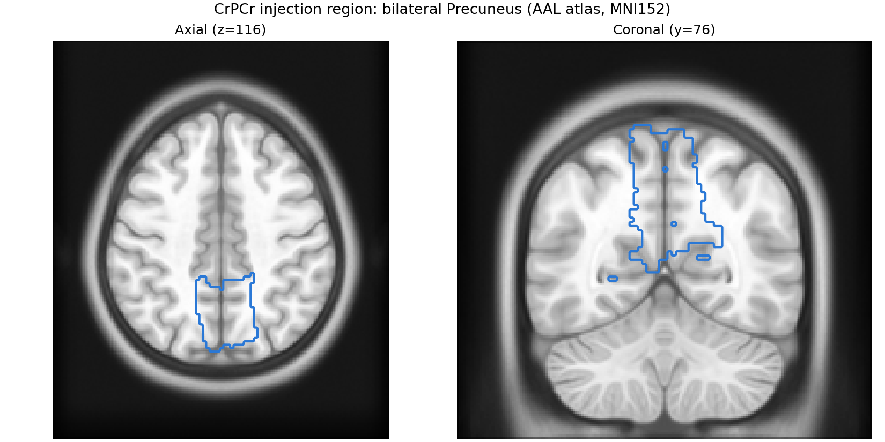
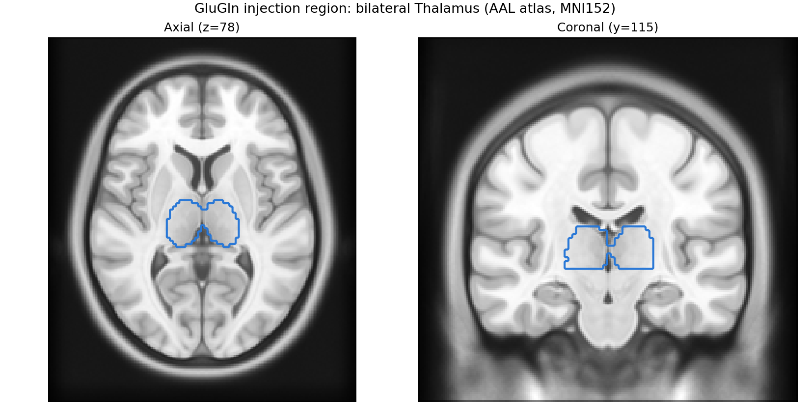
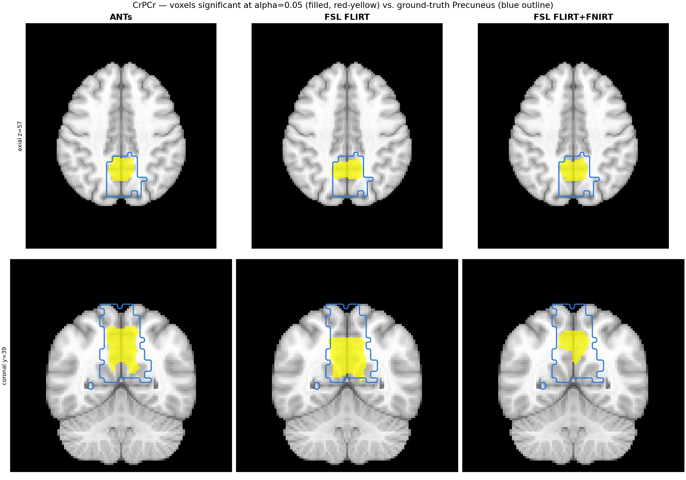
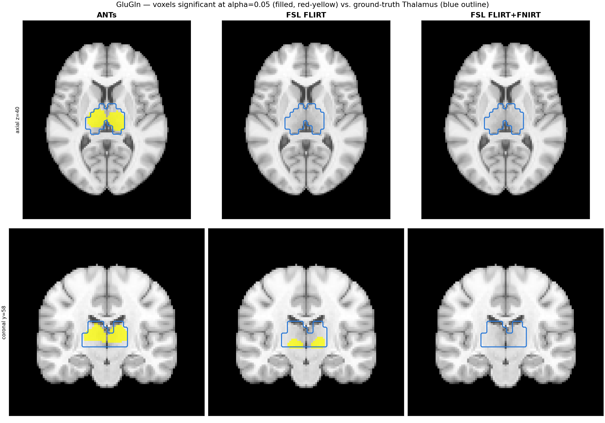
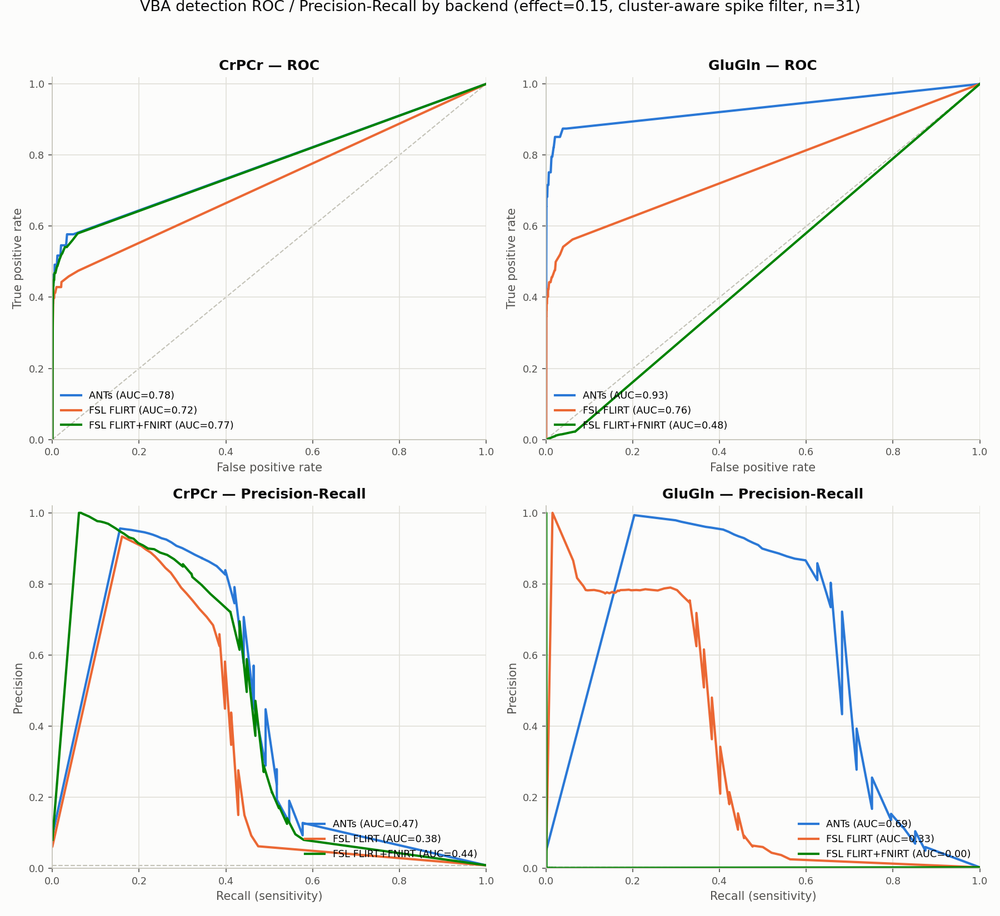

# Voxel-Based Detection Benchmark

This page validates whether MRSIPrep's pipeline — across its three
registration backends (ANTs, FSL FLIRT-only, FSL FLIRT+FNIRT) — can
recover a known, deliberately-injected metabolic abnormality via a
standard voxel-based-analysis (VBA) group comparison (`randomise -T`,
FSL's TFCE-corrected permutation test).

## Dataset

**SynthMRSI-VBA-Project** is a synthetic validation dataset: 32 dummy
subjects, each built from a real T1w anatomical (drawn from
BioPsych-Project/Mindfulness-Project/22q11-Project template subjects) and
model-synthesized MRSI metabolite signal. For subjects assigned
`group=1` (16 of 32), a deterministic Gaussian-style signal bump is added
to every voxel inside a specific bilateral anatomical region, per
metabolite, before the signal is warped from the template subject's own
T1w-native space into that dummy subject's MRSI-native space and on into
`derivatives/mrsi-orig/`. `group=0` subjects (16 of 32) receive no
injection. This lets `randomise`'s two-sample group contrast
(`group1 > group0`) be checked against a known, exact ground truth,
independent of registration backend.

This report covers **CrPCr** (bilateral Precuneus) and **GluGln**
(bilateral Thalamus) only. The other three injected metabolites
(NAANAAG, GPCPCh, Ins) showed no detectable signal above chance for any
backend at the injected effect size and are out of scope here.

### Spike filter interaction

An earlier version of this benchmark showed near-zero detection across
every metabolite and backend. The root cause: MRSIPrep's biharmonic
spike-repair filter (`--spikepc`, default 99th percentile) was removing
the injected abnormality before it ever reached registration — a
spatially uniform region injection looks exactly like a spike artifact
under a flat per-voxel threshold. This is now fixed with **cluster-size-
aware spike filtering**: a connected cluster of spike-thresholded voxels
is only median-repaired/biharmonic-inpainted when its size is at or below
`--spike-max-cluster-voxels` (default: auto-derived from the MRSI
acquisition's native voxel size — 6 voxels at ~5.0mm/3T-like resolution,
9 voxels at ~3.4mm/7T-like resolution). Larger, spatially coherent
clusters — like a genuine focal abnormality — are left unfiltered. The
default cutoffs were derived from the 90th-percentile connected-cluster
size in a real spike-cluster-size survey across 1075 3T metabolite maps
(BioPsych-Project + Mindfulness-Project) and 445 7T metabolite maps
(22q11-Project).

### Runs compared

All three registration backends were run on the same 32 dummy subjects
(one subject excluded for an independently-confirmed bad registration —
see below), at 2mm MNI resolution, then compared with `randomise -T`
(500 permutations, two-sample unpaired design, contrast `group1 >
group0`) restricted to each metabolite's population quality mask (CRLB
&lt; 20 in ≥70% of subjects).

| | |
|---|---|
| Subjects | 31 of 32 (sub-30 excluded: independently confirmed bad registration at both the MRSI→T1w and T1w→MNI stages, unrelated to the spike-filter fix) |
| Group sizes | 15 vs. 16 |
| Permutations | 500 |
| Resolution | 2mm MNI |
| Quality mask | CRLB &lt; 20 in ≥70% of subjects, per metabolite |
| Significance threshold | `alpha = 0.05` (TFCE-corrected, `corrp > 0.95`) |

## Injection regions

The figures below outline each metabolite's injection region using a
**real AAL atlas parcellation image** (not the population ground-truth
mask used later in this report) — the same template subject and region
IDs actually used by the injection for one representative dummy subject,
confirmed via `derivatives/mrsiprep/synthetic_orig_transform_provenance.tsv`:
CrPCr uses AAL region IDs 67/68 (Precuneus L/R), GluGln uses AAL region
IDs 77/78 (Thalamus L/R), from that template subject's own
`space-mni_atlas-aal_dseg.nii.gz`.

**CrPCr — bilateral Precuneus:**

**GluGln — bilateral Thalamus:**

## Detection results by backend

For each metabolite, the same axial/coronal slice positions as above
show:
- **Filled (red-yellow)**: voxels significant at `alpha=0.05` from that
  backend's `randomise` output, restricted to the population quality
  mask.
- **Outline (blue)**: the population ground-truth injection mask (the
  per-subject injection masks, averaged across all `group=1` subjects
  and thresholded at &gt;0) — this is the one place in this report the
  ground-truth mask itself is used, for comparing detected voxels
  against the known injection footprint.

**CrPCr:**

All three backends detect a cluster well inside the true Precuneus
region. FSL FLIRT+FNIRT's detected cluster is visibly smaller than
ANTs' or FSL FLIRT-only's, consistent with its lower sensitivity in the
ROC/PR results below.

**GluGln:**

ANTs detects a clean, tightly bilateral cluster inside the Thalamus.
FSL FLIRT-only detects a real but visibly asymmetric cluster (stronger
on one side). **FSL FLIRT+FNIRT detects nothing at `alpha=0.05`** —
zero significant voxels at either slice — matching its near-chance
ROC-AUC below.

## ROC / Precision-Recall curves

A single `alpha=0.05` snapshot only shows one point on each backend's
detection tradeoff curve. Sweeping the TFCE-corrected significance
threshold (`corrp`) across its full range gives the complete ROC and
precision-recall curves and their AUC — a threshold-independent measure
of total discriminative power.

| Backend | CrPCr ROC-AUC | CrPCr PR-AUC | GluGln ROC-AUC | GluGln PR-AUC |
|---|---|---|---|---|
| ANTs | 0.78 | 0.47 | 0.93 | 0.69 |
| FSL FLIRT-only | 0.72 | 0.38 | 0.76 | 0.33 |
| FSL FLIRT+FNIRT | 0.77 | 0.44 | 0.48 | 0.00 |

### Interpretation

* **ANTs has the best detection power on both metabolites**, most
  clearly on GluGln (ROC-AUC 0.93, PR-AUC 0.69 — both substantially
  ahead of either FSL variant).

* **FSL FLIRT+FNIRT is competitive with ANTs on CrPCr** (ROC-AUC 0.77 vs.
  0.78) **but collapses to near-chance on GluGln** (ROC-AUC 0.48, PR-AUC
  0.00 — no better than random). This is specific to the Thalamus, a
  small, deep, centrally-located structure — consistent with the
  Registration Frameworks benchmark's (see the [Benchmarks](benchmarks.md)
  page) finding that FNIRT's nonlinear warp has higher signal-weighted
  leakage than ANTs or FLIRT-only: a small deep structure is exactly
  where local nonlinear-warp distortion would do the most damage to a
  focal signal.

* **FSL FLIRT-only is consistently the weakest of the three backends on
  both metabolites, but still clearly above chance** (ROC-AUC 0.72 and
  0.76) — real detection power, just less than ANTs.

* Taken together with the Registration Frameworks benchmark, ANTs is the
  best-supported default for analyses where recovering a real, focal
  signal change matters; FSL FLIRT+FNIRT's extra registration cost (see
  the runtime comparison on the [Benchmarks](benchmarks.md) page) does
  not translate into better — and for deep structures, translates into
  markedly worse — detection power than FLIRT-only.
