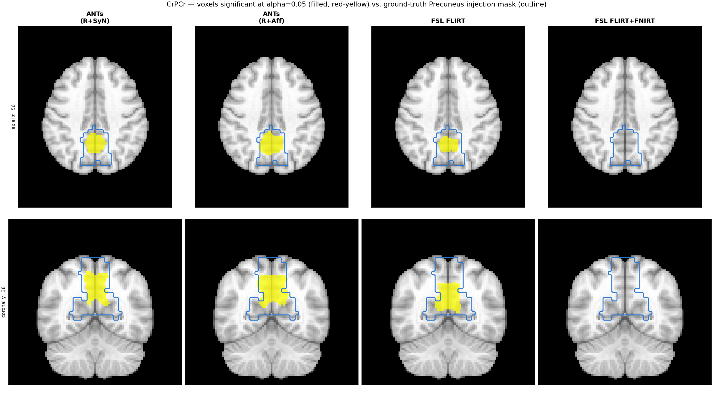
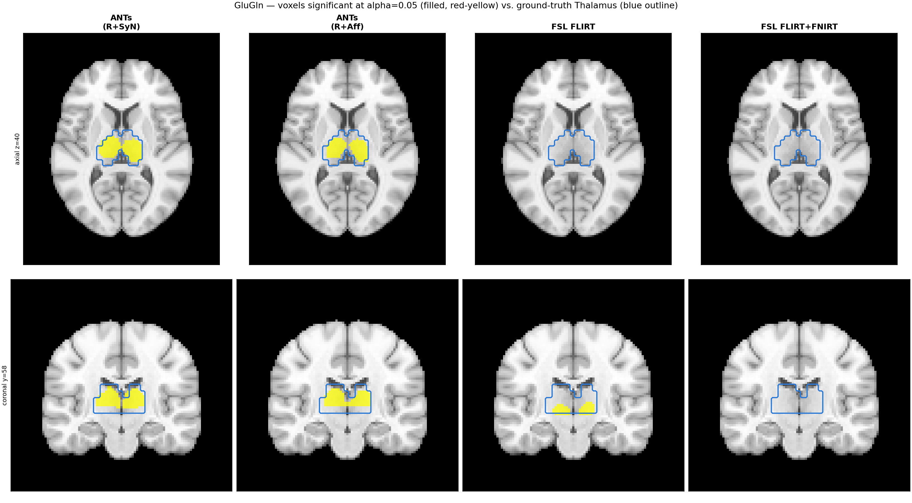
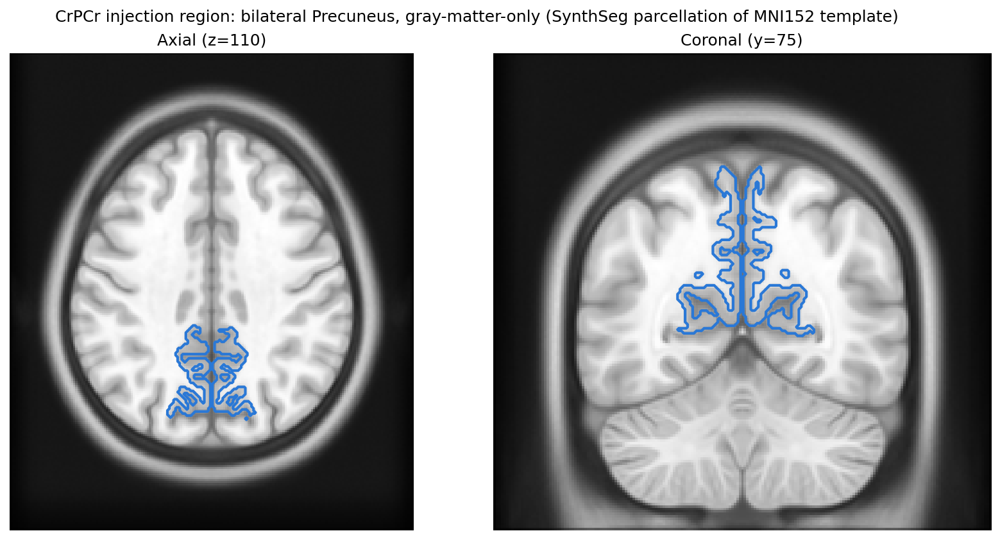
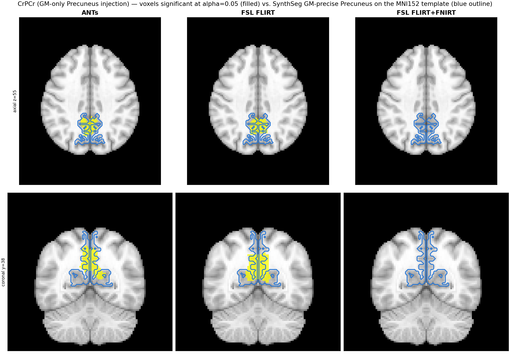
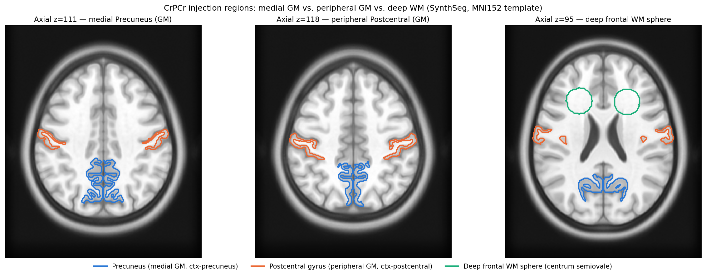
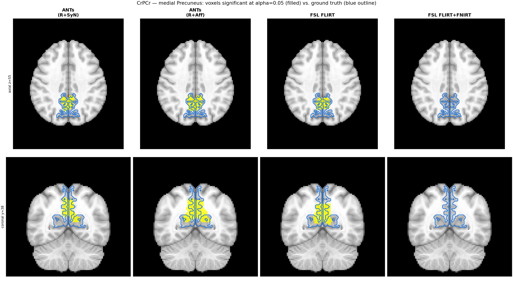
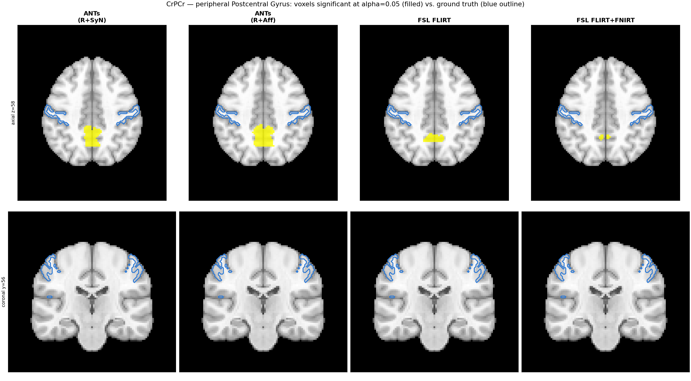
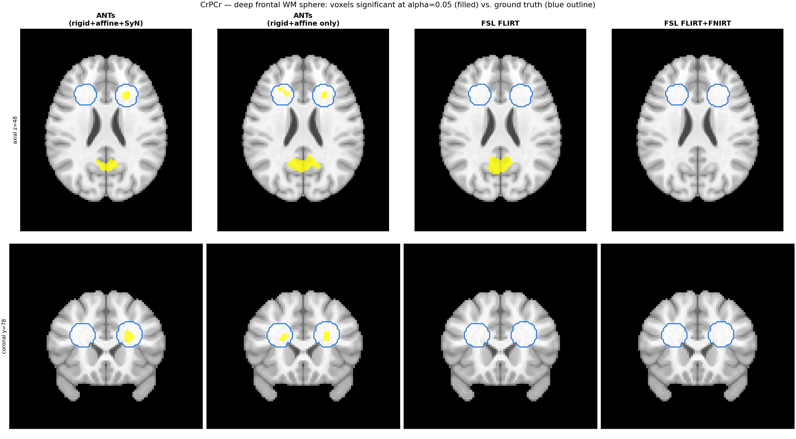
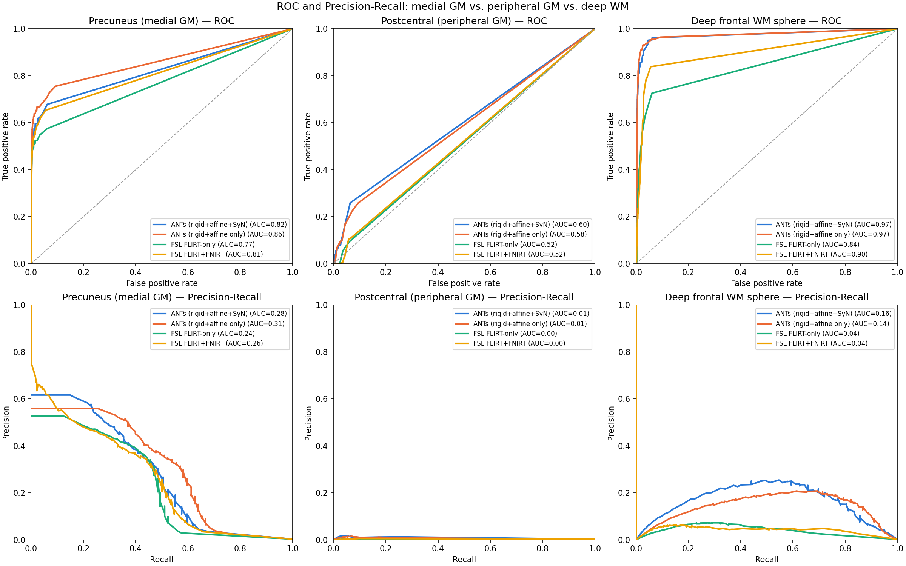

# Voxel-Based Detection Benchmark

This page validates whether MRSIPrep's pipeline — across four
registration configurations (**ANTs (SyN)**, **ANTs (no SyN)**, FSL
FLIRT-only, FSL FLIRT+FNIRT — see the note on ANTs transform stages
below) — can recover a known, deliberately-injected metabolic
abnormality via a standard voxel-based-analysis (VBA) group comparison
(`randomise -T`, FSL's TFCE-corrected permutation test).

**A note on the ANTs transform stages, since the two ANTs
configurations compared here are not simply "with SyN" vs. "rigid+affine,
without SyN":** mrsiprep's default ANTs transform codes are
`ants-mrsi-to-t1-transform=sr` (Rigid + SyN — no separate Affine stage)
for MRSI→T1w, and `ants-t1-to-mni-transform=s` (Rigid + Affine + SyN)
for T1w→MNI. **ANTs (SyN)** is this default, full pipeline. **ANTs (no
SyN)** drops only the deformable SyN warp from each stage while keeping
everything else identical — which means, precisely, **Rigid-only**
MRSI→T1w composed with **Rigid+Affine** T1w→MNI, not "rigid+affine" at
both stages. `antsRegistration` always writes each stage's linear
transform to its own independent `.mat` file regardless of whether a
later SyN stage also ran, so this comparison reuses the exact same
already-computed registrations with no recompute — see "Runs compared"
below.

## Dataset

**SynthMRSI-VBA-Project** is a synthetic validation dataset: 32 dummy
subjects, each built from a real T1w anatomical (drawn from
BioPsych-Project/Mindfulness-Project/22q11-Project template subjects) and
model-synthesized MRSI metabolite signal. For subjects assigned
`group=1` (16 of 32), a deterministic Gaussian-style signal bump is added
to every voxel inside a specific bilateral anatomical region, per
metabolite, before the signal is warped from the template subject's own
T1w-native space into that dummy subject's MRSI-native space and on into
`derivatives/mrsi-orig/`. `group=0` subjects (16 of 32) receive no
injection. This lets `randomise`'s two-sample group contrast
(`group1 > group0`) be checked against a known, exact ground truth,
independent of registration backend.

This report covers **CrPCr** (bilateral Precuneus) and **GluGln**
(bilateral Thalamus) only. The other three injected metabolites
(NAANAAG, GPCPCh, Ins) showed no detectable signal above chance for any
backend at the injected effect size and are out of scope here.

### Spike filter interaction

An earlier version of this benchmark showed near-zero detection across
every metabolite and backend. The root cause: MRSIPrep's biharmonic
spike-repair filter (`--spikepc`, default 99th percentile) was removing
the injected abnormality before it ever reached registration — a
spatially uniform region injection looks exactly like a spike artifact
under a flat per-voxel threshold. This is now fixed with **cluster-size-
aware spike filtering**: a connected cluster of spike-thresholded voxels
is only median-repaired/biharmonic-inpainted when its size is at or below
`--spike-max-cluster-voxels` (default: auto-derived from the MRSI
acquisition's native voxel size — 6 voxels at ~5.0mm/3T-like resolution,
9 voxels at ~3.4mm/7T-like resolution). Larger, spatially coherent
clusters — like a genuine focal abnormality — are left unfiltered. The
default cutoffs were derived from the 90th-percentile connected-cluster
size in a real spike-cluster-size survey across 1075 3T metabolite maps
(BioPsych-Project + Mindfulness-Project) and 445 7T metabolite maps
(22q11-Project).

### Runs compared

Four registration configurations were run on the same 32 dummy subjects
(one subject excluded for an independently-confirmed bad registration —
see below), at 2mm MNI resolution, then compared with `randomise -T`
(500 permutations, two-sample unpaired design, contrast `group1 >
group0`) restricted to each metabolite's population quality mask (CRLB
&lt; 20 in ≥70% of subjects). **ANTs (no SyN)** reuses the *same*
MRSI→T1w and T1w→MNI registrations already computed for the full
**ANTs (SyN)** run, with only the deformable SyN warp dropped from the
resampling transform chain at each stage (see the note above on what
that leaves: Rigid-only MRSI→T1w, Rigid+Affine T1w→MNI) — no
registration recompute needed.

| | |
|---|---|
| Subjects | 31 of 32 (sub-30 excluded: independently confirmed bad registration at both the MRSI→T1w and T1w→MNI stages, unrelated to the spike-filter fix) |
| Group sizes | 15 vs. 16 |
| Permutations | 500 |
| Resolution | 2mm MNI |
| Quality mask | CRLB &lt; 20 in ≥70% of subjects, per metabolite |
| Significance threshold | `alpha = 0.05` (TFCE-corrected, `corrp > 0.95`) |

## Injection regions

The figures below outline each metabolite's injection region using a
**real AAL atlas parcellation image** (not the population ground-truth
mask used later in this report) — the same template subject and region
IDs actually used by the injection for one representative dummy subject,
confirmed via `derivatives/mrsiprep/synthetic_orig_transform_provenance.tsv`:
CrPCr uses AAL region IDs 67/68 (Precuneus L/R), GluGln uses AAL region
IDs 77/78 (Thalamus L/R), from that template subject's own
`space-mni_atlas-aal_dseg.nii.gz`.

**CrPCr — bilateral Precuneus:**

**GluGln — bilateral Thalamus:**

## Detection results by backend

For each metabolite, the same axial/coronal slice positions as above
show:
- **Filled (red-yellow)**: voxels significant at `alpha=0.05` from that
  backend's `randomise` output, restricted to the population quality
  mask.
- **Outline (blue)**: the population ground-truth injection mask (the
  per-subject injection masks, averaged across all `group=1` subjects
  and thresholded at &gt;0) — this is the one place in this report the
  ground-truth mask itself is used, for comparing detected voxels
  against the known injection footprint.

**CrPCr:**

All four configurations detect a cluster well inside the true Precuneus
region. FSL FLIRT+FNIRT's detected cluster is visibly smaller than the
other three, consistent with its lower sensitivity in the ROC/PR
results below.

**GluGln:**

ANTs (both with and without the SyN stage) detects a clean, tightly
bilateral cluster inside the Thalamus. FSL FLIRT-only detects a real
but visibly asymmetric cluster (stronger on one side). **FSL
FLIRT+FNIRT detects nothing at `alpha=0.05`** — zero significant
voxels at either slice — matching its near-chance ROC-AUC below.

## ROC / Precision-Recall curves

A single `alpha=0.05` snapshot only shows one point on each backend's
detection tradeoff curve. Sweeping the TFCE-corrected significance
threshold (`corrp`) across its full range gives the complete ROC and
precision-recall curves and their AUC — a threshold-independent measure
of total discriminative power.

| Backend | CrPCr ROC-AUC | CrPCr PR-AUC | GluGln ROC-AUC | GluGln PR-AUC |
|---|---|---|---|---|
| ANTs (SyN) | 0.78 | 0.47 | 0.93 | 0.69 |
| ANTs (no SyN) | 0.83 | 0.50 | 0.95 | 0.65 |
| FSL FLIRT-only | 0.72 | 0.38 | 0.76 | 0.33 |
| FSL FLIRT+FNIRT | 0.77 | 0.44 | 0.48 | 0.00 |

**ANTs (no SyN)** reuses the same MRSI→T1w/T1w→MNI
registrations as the full ANTs run above, with the deformable SyN stage
simply dropped from the resampling transform chain — see the
"GM-precise boundary tracking" section below for why this variant was
added and how it's computed.

### Interpretation

* **ANTs is the best-performing backend on both metabolites**, and
  **the no-SyN variant is consistently at least as good as the
  full SyN pipeline** — on GluGln it has the highest ROC-AUC of any
  backend (0.95), and on CrPCr it leads on both ROC-AUC (0.83) and
  PR-AUC (0.50). The deformable SyN stage does not clearly improve
  detection power over the no-SyN configuration on either metabolite in
  this benchmark.

* **FSL FLIRT+FNIRT is competitive with the ANTs variants on CrPCr**
  (ROC-AUC 0.77, close to ANTs SyN's 0.78) **but collapses to
  near-chance on GluGln** (ROC-AUC 0.48, PR-AUC 0.00 — no better than
  random). This is specific to the Thalamus, a small, deep,
  centrally-located structure — consistent with the Registration
  Frameworks benchmark's (see the [Benchmarks](benchmarks.md) page)
  finding that FNIRT's nonlinear warp has higher signal-weighted
  leakage than ANTs or FLIRT-only: a small deep structure is exactly
  where local nonlinear-warp distortion would do the most damage to a
  focal signal.

* **FSL FLIRT-only is consistently the weakest backend on both
  metabolites, but still clearly above chance** (ROC-AUC 0.72 and
  0.76) — real detection power, just less than either ANTs variant.

* Taken together with the Registration Frameworks benchmark, ANTs is the
  best-supported default for analyses where recovering a real, focal
  signal change matters — and since the no-SyN variant matches or
  exceeds full SyN's detection power here at a fraction of the
  registration cost (see the runtime comparison on the
  [Benchmarks](benchmarks.md) page), it is worth considering as the
  default over the full deformable pipeline for VBA workflows
  specifically. FSL FLIRT+FNIRT's extra registration cost does not
  translate into better — and for deep structures, translates into
  markedly worse — detection power than FLIRT-only.

## GM-precise boundary tracking (CrPCr / Precuneus only)

The CrPCr/Precuneus injection above used the raw AAL atlas parcel, which
is only ~62% gray matter in native T1w space (35,227 mm³ total parcel vs.
21,789 mm³ at CAT12 GM-probability &gt;0.5) — its coarse boundary sweeps
into adjacent white matter rather than tightly tracing the folded
cortical ribbon. Bulk-overlap metrics like Dice can't tell whether a
detected cluster actually *tracks the true convoluted GM boundary*, or
just overlaps the same general neighborhood. This follow-up re-injects
CrPCr's abnormality restricted to gray matter only, then adds a
boundary-distance metric to directly measure boundary-tracking accuracy.

### GM-only region source

Instead of intersecting the AAL parcel with a separate gray-matter
probability map, the injection's region *source* itself was switched to
`mri_synthseg --parc`'s own DKT cortical labels
(`ctx-lh-precuneus`/`ctx-rh-precuneus`) for the same template subject —
these are inherently gray-matter-only, per-gyrus regions, so no separate
masking step is needed. The combined bilateral region shrinks from
35,227 mm³ (AAL) to 20,425 mm³ (SynthSeg) in native T1w space, and its
boundary is visibly more convoluted:

Only CrPCr's injection region changed — GluGln/Thalamus and the other
three metabolites keep their original AAL-based regions unchanged
(Thalamus is already a compact subcortical nucleus, not a folded cortical
structure, so the boundary-complexity question doesn't apply there). The
signal was re-filtered (same cluster-size-aware spike filter) and
re-resampled into MNI space through each backend's already-computed
registration transforms — no registration rerun, since registration
depends only on anatomy, not on the injected signal.

### Detection vs. the GM-precise ground truth

The population ground-truth mask used earlier in this report (the mean
of all 16 `group=1` subjects' own injection masks) is appropriate for
the AAL-parcel comparison above, but is the wrong reference here: each
subject's own injected region is correctly gray-matter-only and
convoluted, but averaging 16 of them across their own individual
inter-subject registration variance smooths the union back out into a
diffuse, AAL-shaped blob (confirmed directly: no voxel is inside the
injected region for more than 50% of `group=1` subjects). Instead, the
ground-truth outline below is `mri_synthseg --parc`'s own segmentation
of the **MNI152 template itself** — the same fixed anatomical space
every backend's detected voxels are already shown in, so no
inter-subject registration variance is introduced and the true
gyrus-following boundary stays sharp:

| Backend | Dice | Sensitivity | Precision | ROC-AUC | PR-AUC |
|---|---|---|---|---|---|
| ANTs (SyN) | 0.341 | 0.244 | 0.569 | 0.810 | 0.315 |
| ANTs (no SyN) | 0.432 | 0.374 | 0.510 | 0.849 | 0.326 |
| FSL FLIRT-only | 0.326 | 0.250 | 0.470 | 0.773 | 0.238 |
| FSL FLIRT+FNIRT | 0.017 | 0.009 | 0.721 | 0.815 | 0.268 |

**ANTs (no SyN) has the best Dice, sensitivity, and ROC-AUC
of all four backends** on this harder, GM-precise target — the
deformable SyN stage actually *reduces* Dice here (0.341 vs. 0.432)
relative to skipping it. This mirrors the pattern seen on the
coarser AAL-parcel version of this benchmark above: SyN's nonlinear
warp does not clearly help focal-signal detection, and on this metric
actively hurts it.

Dice drops for every backend relative to the AAL-parcel version of this
benchmark — expected, since a tight, convoluted GM boundary is a
harder target to hit exactly than a bulk parcel. **FSL FLIRT+FNIRT's
Dice collapses to 0.017** — visibly almost no detected voxels at
`alpha=0.05` in the figure above — while its ROC-AUC (0.815) is close
to ANTs SyN's and not far off ANTs (no SyN)'s. This combination
means FLIRT+FNIRT's `corrp` map does carry real discriminative signal,
but it is spread too diffusely (or offset) to ever cross the
TFCE-corrected significance threshold in the right place, rather than
lacking signal altogether.

### Boundary-distance metric

Dice and ROC/PR-AUC summarize bulk voxel overlap and threshold-sweep
discriminative power, but neither directly measures *where* a detected
cluster's edge sits relative to the true boundary. `experiments/compare_ground_truth_boundary.py`
extracts the voxel-surface of the alpha=0.05 detected mask and of the
GM-precise ground-truth mask (the same MNI152-template SynthSeg
Precuneus segmentation used above), then reports the symmetric mean
surface distance and Hausdorff distance (mm) between them:

| Backend | Mean surface distance (mm) | Hausdorff distance (mm) |
|---|---|---|
| ANTs (SyN) | 5.47 | 23.07 |
| ANTs (no SyN) | 4.32 | 22.36 |
| FSL FLIRT-only | 6.46 | 33.11 |
| FSL FLIRT+FNIRT | 17.94 | 45.52 |

### Interpretation

* **ANTs (no SyN) tracks the true gray-matter boundary most
  closely of all four backends** (4.32mm mean surface distance —
  under two and a half voxels at this 2mm resolution), narrowly ahead
  of full ANTs SyN (5.47mm) and FSL FLIRT-only (6.46mm). Skipping the
  deformable stage does not cost boundary precision here — if
  anything, it modestly improves it, consistent with SyN's effect on
  Dice above.

* **FSL FLIRT+FNIRT's boundary is roughly 3-4x farther from the true
  GM boundary than either ANTs variant** (17.94mm mean, 45.52mm
  Hausdorff, vs. ANTs (no SyN)'s 4.32mm/22.36mm) — this is the
  clearest signal in this follow-up that FNIRT's nonlinear warp,
  whatever discriminative power it retains (reflected in its
  ROC-AUC), is not spatially anchoring that signal to the correct
  convoluted cortical shape. Combined with its collapsed Dice, this
  reinforces the same conclusion as the Registration Frameworks
  benchmark's leakage finding: FNIRT's warp trades spatial precision
  for something that superficially still separates group1/group0 in
  aggregate, which is the wrong tradeoff for voxel-based analyses of
  focal cortical abnormalities.

* **Ranking is unchanged from the coarser AAL-parcel benchmark** (ANTs
  variants ≥ FSL FLIRT-only ≫ FSL FLIRT+FNIRT), but the gap between
  FLIRT+FNIRT and the other backends widens substantially once the
  target requires tracking a genuinely convoluted boundary rather than
  bulk overlap with a smooth parcel — a harder, more realistic test of
  cortical-abnormality detection. Across both the AAL-parcel and
  GM-precise versions of this benchmark, **ANTs' deformable SyN stage
  never clearly outperforms the no-SyN configuration for this kind of
  focal, planted-signal VBA detection task** — its extra registration cost
  buys smoother anatomical correspondence in general, but not better
  recovery of a known focal abnormality.

## Medial GM vs. peripheral GM vs. deep WM (CrPCr only)

Precuneus is a **medial** cortical structure, tucked against the
brain's midline and relatively far from the skull. This follow-up adds
two further independent injection sites in the same CrPCr channel:
bilateral **postcentral gyrus** (`ctx-lh-postcentral`/`ctx-rh-postcentral`,
primary somatosensory cortex) — a comparably sized, GM-only cortical
region at the **periphery** of the brain, directly under the parietal
convexity immediately behind the central sulcus — and a **deep white
matter** target, a bilateral pair of ~13mm-radius spheres near the
centrum semiovale (deep frontal WM, intersected with SynthSeg's own
WM label so the injection never spills into gray matter or CSF; no
SynthSeg sub-parcellation of WM exists, so a size-matched sphere pair
is the closest fair-volume WM analogue to the two cortical targets):

All three regions were injected simultaneously into the same CrPCr
channel (the injection, spike-filtering, and resampling machinery is
region-shape-agnostic — the WM sphere was folded into the same
label-based mechanism as the two named cortical regions via a
temporary synthetic label painted into a per-subject copy of the
SynthSeg parcellation, rather than a separate code path), with the
same uniform per-subject bump amplitude (effect × whole-brain p95,
confirmed via `synthetic_orig_transform_provenance.tsv`) applied
identically at all three sites. Detection and boundary-distance
metrics are reported **per region** below, since combining three
spatially disjoint clusters into one Dice/boundary number would blur
exactly the comparison this follow-up is meant to make.

### A pre-existing artifact, and how it's handled below

Every backend's CrPCr `corrp` map contains one additional
significant cluster (~700 voxels at `alpha=0.05`) near the posterior
cingulate/periventricular CSF, well outside all three injected
regions. This is **not** an effect of the WM sphere or any change made
in this follow-up — the identical cluster, in the identical location,
is already present in the Precuneus+Postcentral-only run before the WM
sphere was ever added, so it predates and is unrelated to the work on
this page. Its cause hasn't been tracked down (candidates include a
registration-quality edge effect near the ventricles, or leakage from
the CRLB-based quality mask's own boundary), but leaving it in
un-flagged would matter here specifically: since Hausdorff distance is
a worst-case metric, a single distant unrelated cluster is enough to
dominate it and make every region's boundary-distance numbers look far
worse than the *local* detection quality actually is. The boundary
distances below are therefore restricted to detected voxels within
20mm of each region's own ground truth — Dice, sensitivity, precision,
ROC-AUC, and PR-AUC are unrestricted (bulk-overlap and threshold-sweep
metrics aren't distorted by a single distant cluster the same way, so
no adjustment was needed for those). The raw, uncropped detection maps
are shown as-is in the figures below, including this stray cluster
where it falls inside a plotted slice.

### Detection results by cluster and backend

**Precuneus (medial GM):**

**Postcentral gyrus (peripheral GM):**

**No backend detects any voxel at `alpha=0.05` anywhere in the
peripheral Postcentral Gyrus region** — zero filled voxels at every
panel above, for all four registration configurations.

**Deep frontal WM sphere:**

The large yellow cluster visible near the bottom of every panel above
is the pre-existing stray artifact described above, not a WM-sphere
detection — the actual WM-sphere detections are the small clusters
sitting inside or against the blue circles. ANTs (both configurations)
detects real voxels inside at least one sphere; FSL FLIRT and FSL
FLIRT+FNIRT detect nothing inside either sphere at `alpha=0.05`.

| Region | Backend | Dice | Sensitivity | Precision | ROC-AUC | PR-AUC | Mean surface distance (mm) | Hausdorff (mm) |
|---|---|---|---|---|---|---|---|---|
| Precuneus (medial GM) | ANTs (SyN) | 0.341 | 0.251 | 0.530 | 0.824 | 0.281 | 5.39 | 23.07 |
| Precuneus (medial GM) | ANTs (no SyN) | 0.420 | 0.371 | 0.483 | 0.859 | 0.307 | 4.34 | 22.36 |
| Precuneus (medial GM) | FSL FLIRT-only | 0.322 | 0.244 | 0.471 | 0.771 | 0.235 | 6.62 | 33.11 |
| Precuneus (medial GM) | FSL FLIRT+FNIRT | 0.012 | 0.006 | 0.733 | 0.813 | 0.256 | 18.79 | 46.09 |
| Postcentral gyrus (peripheral GM) | ANTs (SyN) | 0.000 | 0.000 | 0.000 | 0.597 | 0.009 | 43.10 | 75.92 |
| Postcentral gyrus (peripheral GM) | ANTs (no SyN) | 0.000 | 0.000 | 0.000 | 0.584 | 0.007 | 40.69 | 71.86 |
| Postcentral gyrus (peripheral GM) | FSL FLIRT-only | 0.000 | 0.000 | 0.000 | 0.516 | 0.004 | 59.64 | 96.62 |
| Postcentral gyrus (peripheral GM) | FSL FLIRT+FNIRT | 0.000 | 0.000 | 0.000 | 0.520 | 0.004 | n/a | n/a |
| Deep frontal WM sphere | ANTs (SyN) | 0.053 | 0.047 | 0.062 | 0.973 | 0.163 | 23.27 | 54.48 |
| Deep frontal WM sphere | ANTs (no SyN) | 0.058 | 0.065 | 0.053 | 0.973 | 0.140 | 7.50 | 13.86 |
| Deep frontal WM sphere | FSL FLIRT-only | 0.000 | 0.000 | 0.000 | 0.842 | 0.039 | n/a | n/a |
| Deep frontal WM sphere | FSL FLIRT+FNIRT | 0.000 | 0.000 | 0.000 | 0.899 | 0.042 | n/a | n/a |

(`n/a` boundary-distance entries mean that backend detected zero
voxels within 20mm of that region's own ground truth at all — Dice=0
already reports this, the boundary distance is simply undefined rather
than artificially large or small.)

The Precuneus and Postcentral numbers here are consistent with the
earlier two-cluster run (small differences are permutation-test noise
from a fresh `randomise` run and the boundary-distance neighborhood
restriction described above, not a methodology change) — confirming
all three regions' injections are independent.

### ROC / Precision-Recall by cluster

The three regions tell three different stories. **Precuneus** shows
moderate ROC-AUC (0.77-0.86) with real PR-AUC (0.24-0.33) — genuine,
reasonably well-localized detection. **Postcentral** stays at or barely
above chance on both metrics (ROC-AUC 0.52-0.60, PR-AUC 0.004-0.010) —
essentially no usable signal reaches significance there. **The deep WM
sphere is the most surprising result of this follow-up: it has the
*highest* ROC-AUC of all three regions for every backend** (0.84-0.97),
and — for ANTs specifically — real PR-AUC (0.14-0.16, comparable to
Precuneus). But its Dice is far lower than Precuneus's (0.05-0.06 vs.
0.32-0.42) despite that strong ROC-AUC. This combination — strong
group-level statistical separation, weak spatial precision — is a
different failure mode than Postcentral's "no signal reaches
significance anywhere": the WM sphere's `corrp` map does carry a
strong, well-separated signal, but that signal is not tightly
localized to the true injected voxels, so relatively few of the
significant voxels land inside the true sphere at `alpha=0.05` even
though the region as a whole is statistically distinguishable.

### Why: registration variance, not injection strength

Comparing group-level statistics directly on the merged 4D signal used
as `randomise`'s input (ANTs SyN backend, n=31, from
`experiments/results/vba_ants_no30_3cluster_500perm/merged/`):

| Region | group=1 mean | group=0 mean | Difference | Inter-subject SD of per-subject regional mean |
|---|---|---|---|---|
| Precuneus (medial GM) | 1393.2 | 1315.4 | 77.7 | 62.4 |
| Postcentral gyrus (peripheral GM) | 1005.1 | 939.4 | 65.7 | 138.3 |
| Deep frontal WM sphere | 1493.7 | 1358.5 | 135.2 | 102.5 |

The WM sphere actually shows the **largest raw group difference of the
three regions** (135.2) — consistent with its high ROC-AUC, since a
`randomise` group contrast is fundamentally a signal-to-noise
comparison and a large mean difference helps regardless of tissue
class. Its inter-subject SD (102.5) sits between Precuneus's (62.4)
and Postcentral's (138.3): more variable than the medial GM target,
but noticeably less variable than the peripheral GM target. This
partially explains the WM sphere's Dice/ROC-AUC divergence: enough
signal-to-noise to reliably reject the null hypothesis somewhere in or
near the region (driving ROC-AUC up), but not enough spatial
consistency across subjects for the *specific* significant voxels to
land tightly inside the true sphere every time (keeping Dice low). Deep
WM's own registration behavior — smoother, less-textured white matter
gives image-registration cost functions less local structure to lock
onto than a folded gyrus — is a plausible contributor, though this
follow-up doesn't directly measure WM-specific registration accuracy to
confirm that mechanism.

### Interpretation

* **A real focal abnormality at the cortical periphery is
  systematically harder to recover in group-level VBA than the same
  abnormality placed medially — for every registration backend
  tested, with no exception.** This isn't a backend-specific weakness;
  it reflects that lateral, superficial cortical folding is less
  spatially consistent across subjects after registration (to any of
  the four configurations) than the more stereotyped medial Precuneus.

* **Deep white matter is a genuinely different case, not just a third
  point on the same medial-to-peripheral axis.** It has real,
  sometimes the strongest, statistical detectability (ROC-AUC), but
  poor spatial precision (Dice) — a VBA study targeting WM abnormalities
  should not assume that "significant somewhere in the structure" means
  "significant at the true lesion location."

* **Backend ranking is broadly consistent across all three regions**
  (ANTs (no SyN) ≥ ANTs (SyN) > FSL FLIRT+FNIRT ≥
  FSL FLIRT-only, by ROC-AUC) — the relative registration-quality story
  from the rest of this benchmark still holds, but the *absolute*
  achievable detection power and spatial precision both depend heavily
  on where in the brain, and in which tissue class, the target sits.

* This is a caution for real VBA studies of superficial cortical
  regions and deep white matter alike (much of the association and
  sensorimotor cortex relevant to psychiatric and neurological research
  sits at or near the periphery, and WM tractography-adjacent findings
  are common in the same literature): a well-registered, high-powered
  study can still fail to reach significance for a real focal effect
  at the cortical rim, or can reach significance without pinpointing
  the true lesion location in deep WM, purely because of anatomy —
  independent of which registration backend is used.
